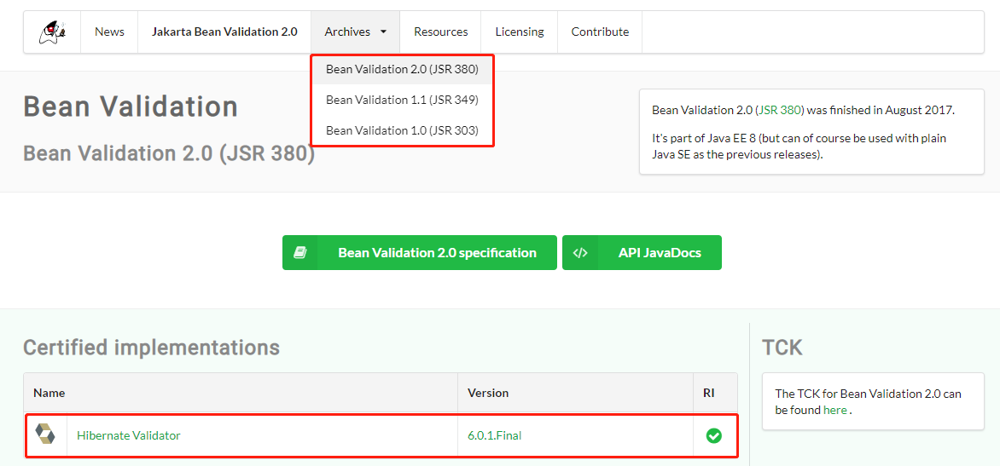
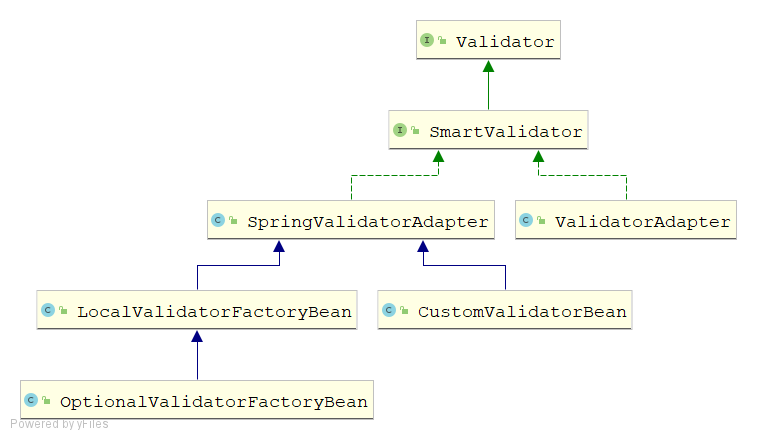
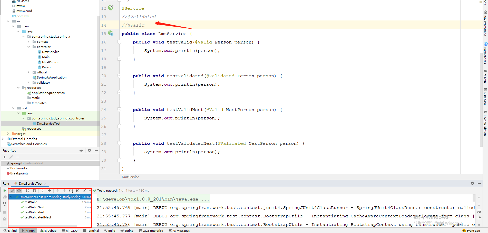
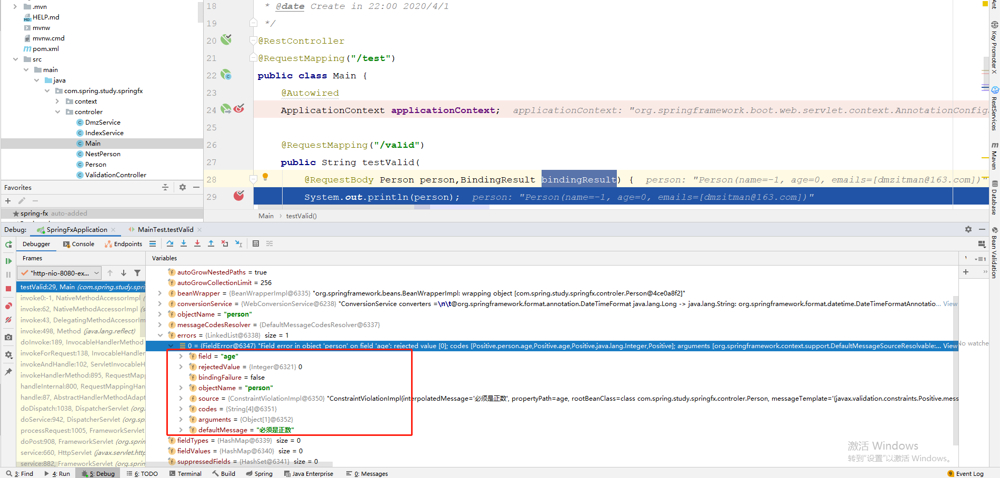

Spring官网阅读（十七）Spring中的数据校验

> 在前文中我们一起学习了Spring中的数据绑定，也就是整个`DataBinder`的体系，其中有提到`DataBinder`跟校验相关。可能对于Spring中的校验大部分同学跟我一一样，都只是知道可以通过`@Valid` / `@Validated`来对接口的入参进行校验，但是对于其底层的具体实现以及一些细节都不是很清楚，通过这篇文章我们就来彻底搞懂Spring中的校验机制。
>
> 在学习Spring中某个功能时，往往要从Java本身出发。比如我们之前介绍过的Spring中的国际化（见《Spring官网阅读（十一）》）、Spring中的`ResolvableType`（见《Spring杂谈》系列文章）等等，它们都是对Java本身的封装，沿着这个思路，我们要学习Spring中的数据校验，必然要先对Java中的数据校验有一定了解。
>
> 话不多说，开始正文！

# Java中的数据校验

> 在学习Java中的数据校验前，我们需要先了解一个概念，即什么是`JSR`?
>
> `JSR`：全称Java Specification Requests，意思是Java 规范提案。我们可以将其理解为Java为一些功能指定的一系列统一的规范。跟数据校验相关的最新的`JSR`为`JSR 380`。
>
> Bean Validation 2.0 是JSR第380号标准。该标准连接如下：https://www.jcp.org/en/egc/view?id=380
> Bean Validation的主页：http://beanvalidation.org
> Bean Validation的参考实现：https://github.com/hibernate/hibernate-validator

## Bean Validation（JSR 380）



从官网中的截图我们可以看到，`Bean Validation 2.0`的唯一实现就是[Hibernate Validator](http://hibernate.org/validator/)，对应版本为`6.0.1.Final`，同时在2.0版本之前还有1.1（JSR 349）及1.0（JSR 303）两个版本，不过版本间的差异并不是我们关注的重点，而且`Bean Validation 2.0`本身也向下做了兼容。

> 在上面的图中，可以看到`Bean Validation2.0`的全称为`Jakarta Bean Validation2.0`，关于Jakarta，感兴趣的可以参考这个链接：https://www.oschina.net/news/94055/jakarta-ee-new-logo，就是Java换了个名字。

## 使用示例

导入依赖：

```xml
<!--除了导入hibernate-validator外，还需要导入一个tomcat-embed-el包，用于提供EL表达式的功能
因为错误message是支持EL表达式计算的，所以需要导入此包
-->
<dependency>
    <groupId>org.apache.tomcat.embed</groupId>
    <artifactId>tomcat-embed-el</artifactId>
    <version>9.0.16</version>
    <scope>compile</scope>
</dependency>
<dependency>
    <groupId>org.hibernate.validator</groupId>
    <artifactId>hibernate-validator</artifactId>
    <version>6.0.14.Final</version>
    <scope>compile</scope>
</dependency>
<!--
如果你用的是一个SpringBoot项目只需要导入下面这个依赖即可

<dependency>
     <groupId>org.springframework.boot</groupId>
     <artifactId>spring-boot-starter-validation</artifactId>
</dependency>

-->
```

测试Demo：

```java
@Data
public class Person {
    
    @NotEmpty
    private String name;
    
    @Positive
    @Max(value = 100)
    private int age;
}

public class SpringValidation {
    public static void main(String[] args) {
        Person person = new Person();
        person.setAge(-1);
        Set<ConstraintViolation<Person>> result =
               Validation.buildDefaultValidatorFactory().getValidator().validate(person);
        // 对结果进行遍历输出
        result.stream().map(v -> v.getPropertyPath() + " " + v.getMessage() + ": " + v.getInvalidValue())
                .forEach(System.out::println);
    }
    // 运行结果：
    // name 不能为空: null
    // age 必须是正数: -1
}
```

对于其中涉及的细节目前来说我不打算过多的探讨，我们现在只需要知道Java提供了数据校验的规范，同时Hibernate对其有一套实现就可以了，并且我们也验证了使用其进行校验是可行的。那么接下来我们的问题就变成了Spring对Java的这套数据校验的规范做了什么支持呢？或者它又做了什么扩展呢？

# Spring对Bean Validation的支持

我们先从官网入手，看看Spring中如何使用数据校验，我这里就直接取官网中的Demo了

```java
@Data
public class Person {
    private String name;
    private int age;
}

public class PersonValidator implements Validator {
    @Override
    public boolean supports(Class clazz) {
        return Person.class.equals(clazz);
    }

    @Override
    public void validate(Object obj, Errors e) {
        ValidationUtils.rejectIfEmpty(e, "name", "name.empty");
        Person p = (Person) obj;
        if (p.getAge() < 0) {
            e.rejectValue("age", "negativevalue");
        } else if (p.getAge() > 110) {
            e.rejectValue("age", "too.darn.old");
        }
    }
}

public class Main {
    public static void main(String[] args) {
        Person person = new Person();
        person.setAge(-1);
        DirectFieldBindingResult errorResult = new DirectFieldBindingResult(person, "dmz");
        PersonValidator personValidator = new PersonValidator();
        personValidator.validate(person, errorResult);
        System.out.println(errorResult);
        // 程序打印：
//Field error in object 'dmz' on field 'name': rejected value [null]; codes //[name.empty.dmz.name,name.empty.name,name.empty.java.lang.String,name.empty]; arguments //[]; default message [null]
//Field error in object 'dmz' on field 'age': rejected value [-1]; codes //[negativevalue.dmz.age,negativevalue.age,negativevalue.int,negativevalue]; arguments //[]; default message [null]
        
    }
}
```

在上面的例子中，`PersonValidator`实现了一个`Validator`接口，这个接口是Spring自己提供的，全称：`org.springframework.validation.Validator`，我们看看这个接口的定义

## Spring中的Validator

> `org.springframework.validation.Validator`是专门用于应用相关的对象的校验器。
>
> 这个接口完全从基础设施或者上下文中脱离的，这意味着它没有跟web层或者数据访问层或者其余任何的某一个层次发生耦合。所以它能用于应用中的任意一个层次，能对应用中的任意一个对象进行校验。，

### 接口定义

```java
public interface Validator {
	
    // 此clazz是否可以被validate
	boolean supports(Class<?> clazz);
	
    // 执行校验，错误消息放在Errors中
    // 如果能执行校验，通常也意味着supports方法返回true
	// 可以参考ValidationUtils这个工具类
	void validate(Object target, Errors errors);
}
```

### UML类图



#### SmartValidator

> 对Validator接口进行了增强，能进行分组校验

```java
public interface SmartValidator extends Validator {

	// validationHints：就是启动的校验组
    // target：需要校验的结果
    // errors：封装校验
    void validate(Object target, Errors errors, Object... validationHints);
	
    // 假设value将被绑定到指定对象中的指定字段上，并进行校验
    // @since 5.1  这个方法子类需要复写 否则不能使用
    default void validateValue(Class<?> targetType, String fieldName, @Nullable Object value, Errors errors, Object... validationHints) {
        throw new IllegalArgumentException("Cannot validate individual value for " + targetType);
    }
}
```

#### SpringValidatorAdapter

> 在之前的接口我们会发现，到目前为止Spring中的校验跟Bean Validation还没有产生任何交集，而SpringValidatorAdapter就完成了到Bean Validation的对接

```java
// 可以看到，这个接口同时实现了Spring中的SmartValidator接口跟JSR中的Validator接口
public class SpringValidatorAdapter implements SmartValidator, javax.validation.Validator {
	
    //@NotEmpty,@NotNull等注解都会有这三个属性
	private static final Set<String> internalAnnotationAttributes = new HashSet<>(4);
	static {
		internalAnnotationAttributes.add("message");
		internalAnnotationAttributes.add("groups");
		internalAnnotationAttributes.add("payload");
	}
	
    // targetValidator就是实际完成校验的对象
	@Nullable
	private javax.validation.Validator targetValidator;
	public SpringValidatorAdapter(javax.validation.Validator targetValidator) {
		Assert.notNull(targetValidator, "Target Validator must not be null");
		this.targetValidator = targetValidator;
	}
	SpringValidatorAdapter() {
	}
	void setTargetValidator(javax.validation.Validator targetValidator) {
		this.targetValidator = targetValidator;
	}

    // 支持对所有类型的Bean的校验
	@Override
	public boolean supports(Class<?> clazz) {
		return (this.targetValidator != null);
	}
	
    // 调用targetValidator完成校验，并通过processConstraintViolations方法封装校验后的结果到Errors中
	@Override
	public void validate(Object target, Errors errors) {
		if (this.targetValidator != null) {
			processConstraintViolations(this.targetValidator.validate(target), errors);
		}
	}
	
    // 完成分组校验
	@Override
	public void validate(Object target, Errors errors, Object... validationHints) {
		if (this.targetValidator != null) {
			processConstraintViolations(
					this.targetValidator.validate(target, asValidationGroups(validationHints)), errors);
		}
	}
	
    // 完成对对象上某一个字段及给定值的校验
	@SuppressWarnings("unchecked")
	@Override
	public void validateValue(
			Class<?> targetType, String fieldName, @Nullable Object value, Errors errors, Object... validationHints) {

		if (this.targetValidator != null) {
			processConstraintViolations(this.targetValidator.validateValue(
					(Class) targetType, fieldName, value, asValidationGroups(validationHints)), errors);
		}
	}


	// @since 5.1
	// 将validationHints转换成JSR中的分组
	private Class<?>[] asValidationGroups(Object... validationHints) {
		Set<Class<?>> groups = new LinkedHashSet<>(4);
		for (Object hint : validationHints) {
			if (hint instanceof Class) {
				groups.add((Class<?>) hint);
			}
		}
		return ClassUtils.toClassArray(groups);
	}

	// 省略对校验错误的封装
    // .....


	
    // 省略对JSR中validator接口的实现，都是委托给targetValidator完成的
    // ......

}

```

#### ValidatorAdapter

> 跟SpringValidatorAdapter同一级别的类，但是不同的是他没有实现JSR中的Validator接口。一般不会使用这个类

#### CustomValidatorBean

```java
public class CustomValidatorBean extends SpringValidatorAdapter implements Validator, InitializingBean {
	
    // JSR中的接口，校验器工厂
	@Nullable
	private ValidatorFactory validatorFactory;
	
    // JSR中的接口，用于封装校验信息
	@Nullable
	private MessageInterpolator messageInterpolator;
	
     // JSR中的接口，用于判断属性能否被ValidatorProvider访问
	@Nullable
	private TraversableResolver traversableResolver;

	// 忽略setter方法
	
    // 在SpringValidatorAdapter的基础上实现了InitializingBean，在Bean初始化时调用，用于给上面三个属性进行配置
	@Override
	public void afterPropertiesSet() {
		if (this.validatorFactory == null) {
			this.validatorFactory = Validation.buildDefaultValidatorFactory();
		}

		ValidatorContext validatorContext = this.validatorFactory.usingContext();
		MessageInterpolator targetInterpolator = this.messageInterpolator;
		if (targetInterpolator == null) {
			targetInterpolator = this.validatorFactory.getMessageInterpolator();
		}
		validatorContext.messageInterpolator(new LocaleContextMessageInterpolator(targetInterpolator));
		if (this.traversableResolver != null) {
			validatorContext.traversableResolver(this.traversableResolver);
		}

		setTargetValidator(validatorContext.getValidator());
	}

}
```

#### LocalValidatorFactoryBean

```java
public class LocalValidatorFactoryBean extends SpringValidatorAdapter
    implements ValidatorFactory, ApplicationContextAware, InitializingBean, DisposableBean {
		//......
}
```

可以看到，这个类额外实现了`ValidatorFactory`接口，所以通过它不仅能完成校验，还能获取一个校验器validator。

#### OptionalValidatorFactoryBean

```java
public class OptionalValidatorFactoryBean extends LocalValidatorFactoryBean {

	@Override
	public void afterPropertiesSet() {
		try {
			super.afterPropertiesSet();
		}
		catch (ValidationException ex) {
			LogFactory.getLog(getClass()).debug("Failed to set up a Bean Validation provider", ex);
		}
	}

}
```

继承了LocalValidatorFactoryBean，区别在于让校验器的初始化成为可选的，即使校验器没有初始化成功也不会报错。

## 使用示例

在对整个体系有一定了解之后，我们通过一个例子来体会下Spring中数据校验

```java
public class Main {
    public static void main(String[] args) {
        AnnotationConfigApplicationContext ac = new AnnotationConfigApplicationContext();
        // 将CustomValidatorBean注册到容器中，主要是为了让它经过初始化阶段完成对校验器的配置
        ac.register(CustomValidatorBean.class);
        // 刷新启动容器
        ac.refresh();
        // 获取到容器中的校验器
        CustomValidatorBean cb = ac.getBean(CustomValidatorBean.class);

        // 校验simple组的校验
        Person person = new Person();
        DirectFieldBindingResult simpleDbr = new DirectFieldBindingResult(person, "person");
        cb.validate(person, simpleDbr, Person.Simple.class);

        // 校验Complex组的校验
        DirectFieldBindingResult complexDbr = new DirectFieldBindingResult(person, "person");
        person.setStart(new Date());
        cb.validate(person, complexDbr, Person.Complex.class);
        System.out.println(complexDbr);
    }
}
```

运行结果我这里就不贴出来了，大家可以自行测试

------

到目前为止，我们所接触到的校验的内容跟实际使用还是有很大区别，我相信在绝大多数情况下大家都不会采用前文所采用的这种方式去完成校验，而是通过`@Validated`或者`@Valid`来完成校验。

# @Validated跟@Valid的区别

关于二者的区别网上有很多文章，但是实际二者的区别大家不用去记，我们只要看一看两个注解的申明变一目了然了。

## @Validated

```java
// Target代表这个注解能使用在类/接口/枚举上，方法上以及方法的参数上
// 注意注意！！！！ 它不能注解到字段上
@Target({ElementType.TYPE, ElementType.METHOD, ElementType.PARAMETER})
// 在运行时期仍然生效（注解不仅被保存到class文件中，jvm加载class文件之后，仍然存在）
@Retention(RetentionPolicy.RUNTIME)
// 这个注解应该被 javadoc工具记录. 默认情况下,javadoc是不包括注解的. 但如果声明注解时指定了 @Documented,则它会被 javadoc 之类的工具处理, 所以注解类型信息也会被包括在生成的文档中，是一个标记注解，没有成员。
@Documented
public @interface Validated {
	// 校验时启动的分组
	Class<?>[] value() default {};

}
```

## @Valid

```java
// 可以作用于类，方法，字段，构造函数，参数，以及泛型类型上(例如：Main<@Valid T> )
// 简单来说，哪里都可以放
@Target({ METHOD, FIELD, CONSTRUCTOR, PARAMETER, TYPE_USE })
@Retention(RUNTIME)
@Documented
public @interface Valid {
    //没有提供任何属性
}
```

我们通过上面两个注解的定义就能很快的得出它们的区别：

1. **来源不同**，`@Valid`是`JSR`的规范，来源于`javax.validation`包下，而`@Validated`是Spring自身定义的注解，位于`org.springframework.validation.annotation`包下

2. **作用范围不同**，`@Validated`无法作用在字段上，正因为如此它就无法完成对级联属性的校验。而`@Valid`的

   没有这个限制。

3. **注解中的属性不同**，`@Validated`注解中可以提供一个属性去指定校验时采用的分组，而`@Valid`没有这个功能，因为`@Valid`不能进行分组校验

> 我相信通过这个方法的记忆远比看博客死记要好~

# 实际生产应用

> 我们将分为两部分讨论
>
> 1. 对Java的校验
> 2. 对普通参数的校验
>
> 这里说的普通参数的校验是指参数没有被封装到JavaBean中，而是直接使用，例如：
>
> test(String name,int age)，这里的name跟age就是简单的参数。
>
> 而将name跟age封装到JavaBean中，则意味着这是对JavaBean的校验。
>
> 同时，按照校验的层次，我们可以将其分为
>
> 1. 对controller层次（接口层）的校验
> 2. 对普通方法的校验
>
> 接下来，我们就按这种思路一一进行分析
>
> 子所以按照层次划分是因为Spring在对接口上的参数进行校验时，跟对普通的方法上的参数进行校验采用的是不同的形式（*虽然都是依赖于JSR的实现来完成的，但是调用JSR的手段不一样*）

### 对JavaBean的校验

**待校验的类**

```java
@Data
public class Person {

    // 错误消息message是可以自定义的
    @NotNull//(groups = Simple.class)
    public String name;

    @Positive//(groups = Default.class)
    public Integer age;

    @NotNull//(groups = Complex.class)
    @NotEmpty//(groups = Complex.class)
    private List<@Email String> emails;

    // 定义两个组 Simple组和Complex组
    public interface Simple {
    }

    public interface Complex {

    }
}

// 用于进行嵌套校验
@Data
public class NestPerson {
    @NotNull
    String name;

    @Valid
    Person person;
}
```

#### 对controller（接口）层次上方法参数的校验

**用于测试的接口**

```java
// 用于测试的接口
@RestController
@RequestMapping("/test")
public class Main {
	
    // 测试 @Valid对JavaBean的校验效果
    @RequestMapping("/valid")
    public String testValid(
            @Valid @RequestBody Person person) {
        System.out.println(person);
        return "OK";
    }

    // 测试 @Validated对JavaBean的校验效果
    @RequestMapping("/validated")
    public String testValidated(
            @Validated @RequestBody Person person) {
        System.out.println(person);
        return "OK";
    }
    
    // 测试 @Valid对JavaBean嵌套属性的校验效果
    @RequestMapping("/validNest")
    public String testValid(@Valid @RequestBody NestPerson person) {
        System.out.println(person);
        return "OK";
    }
	
    // 测试 @Validated对JavaBean嵌套属性的校验效果
    @RequestMapping("/validatedNest")
    public String testValidated(@Validated @RequestBody NestPerson person) {
        System.out.println(person);
        return "OK";
    }
}
```

**测试用例**

```java
@RunWith(SpringRunner.class)
@SpringBootTest(classes = SpringFxApplication.class)
public class MainTest {

    @Autowired
    private WebApplicationContext context;

    @Autowired
    ObjectMapper objectMapper;

    MockMvc mockMvc;

    Person person;

    NestPerson nestPerson;

    @Before
    public void init() {
        person = new Person();
        person.setAge(-1);
        person.setName("");
        person.setEmails(new ArrayList<>());
        nestPerson = new NestPerson();
        nestPerson.setPerson(person);
        mockMvc = MockMvcBuilders.webAppContextSetup(context).build();
    }

    @Test
    public void testValid() throws Exception {
        MockHttpServletRequestBuilder builder = MockMvcRequestBuilders.post("/test/valid")
                .contentType(MediaType.APPLICATION_JSON)
                .content(objectMapper.writeValueAsString(person));
        MvcResult mvcResult = mockMvc.perform(builder).andReturn();
        Exception resolvedException = mvcResult.getResolvedException();
        System.out.println(resolvedException.getMessage());
        assert mvcResult.getResponse().getStatus()==200;
    }

    @Test
    public void testValidated() throws Exception {
        MockHttpServletRequestBuilder builder = MockMvcRequestBuilders.post("/test/validated")
                .contentType(MediaType.APPLICATION_JSON)
                .content(objectMapper.writeValueAsString(person));
        MvcResult mvcResult = mockMvc.perform(builder).andReturn();
        Exception resolvedException = mvcResult.getResolvedException();
        System.out.println(resolvedException.getMessage());
        assert mvcResult.getResponse().getStatus()==200;
    }

    @Test
    public void testValidNest() throws Exception {
        MockHttpServletRequestBuilder builder = MockMvcRequestBuilders.post("/test/validatedNest")
                .contentType(MediaType.APPLICATION_JSON)
                .content(objectMapper.writeValueAsString(nestPerson));
        MvcResult mvcResult = mockMvc.perform(builder).andReturn();
        Exception resolvedException = mvcResult.getResolvedException();
        System.out.println(resolvedException.getMessage());
        assert mvcResult.getResponse().getStatus()==200;
    }

    @Test
    public void testValidatedNest() throws Exception {
        MockHttpServletRequestBuilder builder = MockMvcRequestBuilders.post("/test/validatedNest")
                .contentType(MediaType.APPLICATION_JSON)
                .content(objectMapper.writeValueAsString(nestPerson));
        MvcResult mvcResult = mockMvc.perform(builder).andReturn();
        Exception resolvedException = mvcResult.getResolvedException();
        System.out.println(resolvedException.getMessage());
        assert mvcResult.getResponse().getStatus()==200;
    }

}
```

**测试结果**


我们执行用例时会发现，四个用例均断言失败并且控制台打印：Validation failed for argument ...........。

另外细心的同学可以发现，Spring默认有一个全局异常处理器`DefaultHandlerExceptionResolver`

同时观察日志我们可以发现，全局异常处理器处理的异常类型为：`org.springframework.web.bind.MethodArgumentNotValidException`

#####　使用注意要点

> 1. **如果想使用分组校验的功能必须使用@Validated**
> 2. 不考虑分组校验的情况，`@Validated`跟`@Valid`没有任何区别
>
> 3. 网上很多文章说`@Validated`不支持对嵌套的属性进行校验，这种说法是不准确的，大家可以对第三，四个接口方法做测试，运行的结果是一样的。更准确的说法是`@Validated`不能作用于字段上，而`@Valid`可以。

#### 对普通方法的校验

待测试的方法

```java
@Service
//@Validated
//@Valid
public class DmzService {
    public void testValid(@Valid Person person) {
        System.out.println(person);
    }

    public void testValidated(@Validated Person person) {
        System.out.println(person);
    }
}
```

测试用例

```java
@RunWith(SpringRunner.class)
@SpringBootTest(classes = SpringFxApplication.class)
public class DmzServiceTest {

    @Autowired
    DmzService dmzService;

    Person person;

    @Before
    public void init(){
        person = new Person();
        person.setAge(-1);
        person.setName("");
        person.setEmails(new ArrayList<>());
    }

    @Test
    public void testValid() {
        dmzService.testValid(person);
    }

    @Test
    public void testValidated() {
        dmzService.testValidated(person);
    }
}
```

我们分为三种情况测试

1. **类上不添加任何注解**



2. **类上添加@Validated注解**


3. **类上添加@Valid注解**


##### 使用注意要点

> 通过上面的例子，我们可以发现，只有类上添加了`@Vlidated`注解，并且待校验的JavaBean上添加了`@Valid`的情况下校验才会生效。
>
> 所以当我们要对普通方法上的JavaBean参数进行校验必须满足下面两个条件
>
> 1. 方法所在的类上添加`@Vlidated`
> 2. 待校验的JavaBean参数上添加`@Valid`

------

### 对简单参数校验

#### 对普通方法的校验

**用于测试的方法**

```java
@Service
@Validated
//@Valid
public class IndexService {
    public void testValid(@Max(10) int age,@NotBlank String name) {
        System.out.println(age+"     "+name);
    }

    public void testValidated(@Max(10) int age,@NotBlank String name) {
        System.out.println(age+"     "+name);
    }

    public void testValidNest(@Max(10) int age,@NotBlank String name) {
        System.out.println(age+"     "+name);
    }

    public void testValidatedNest(@Max(10) int age,@NotBlank String name) {
        System.out.println(age+"     "+name);
    }
}
```

**测试用例**

```java
@RunWith(SpringRunner.class)
@SpringBootTest(classes = SpringFxApplication.class)
public class IndexServiceTest {
    @Autowired
    IndexService indexService;

    int age;

    String name;

    @Before
    public void init(){
        age=100;
        name = "";
    }
    @Test
    public void testValid() {
        indexService.testValid(age,name);
    }
    @Test
    public void testValidated() {
        indexService.testValidated(age,name);
    }
    @Test
    public void testValidNest() {
        indexService.testValidNest(age,name);
    }
    @Test
    public void testValidatedNest() {
        indexService.testValidatedNest(age,name);
    }
}
```

这里的测试结果我就不再放出来了，大家猜也能猜到答案

##### 使用注意要点

> 1. 方法所在的类上添加`@Vlidated`（`@Valid`注解无效），跟JavaBean的校验是一样的

#### 对controller（接口）层次的校验

```java
@RestController
@RequestMapping("/test/simple")
// @Validated
public class ValidationController {

    @RequestMapping("/valid")
    public String testValid(
            @Valid @Max(10) int age, @Valid @NotBlank String name) {
        System.out.println(age + "      " + name);
        return "OK";
    }

    @RequestMapping("/validated")
    public String testValidated(
            @Validated @Max(10) int age, @Valid @NotBlank String name) {
        System.out.println(age + "      " + name);
        return "OK";
    }
}
```

在测试过程中会发现，不过是在参数前添加了`@Valid`或者`@Validated`校验均不生效。这个时候不得不借助Spring提供的普通方法的校验功能来完成数据校验，也就是在类级别上添加` @Valiv=dated`（参数前面的`@Valid`或者`@Validated`可以去除）

##### 使用注意要点

> 对于接口层次简单参数的校验需要借助Spring对于普通方法校验的功能，必须在类级别上添加` @Valiv=dated`注解。

### 注意

在上面的所有例子中我都是用SpringBoot进行测试的，如果在单纯的SpringMVC情况下，如果对于普通方法的校验不生效请添加如下配置：

```java
@Bean
public MethodValidationPostProcessor methodValidationPostProcessor() {
    return new MethodValidationPostProcessor();
}
```

实际上对于普通方法的校验，就是通过这个后置处理器来完成的，它会生成一个代理对象帮助我们完成校验。SpringBoot中默认加载了这个后置处理器，而SpringMVC需要手动配置

## 结合BindingResult使用

在上面的例子中我们可以看到，当对于接口层次的JavaBean进行校验时，如果校验失败将会抛出`org.springframework.web.bind.MethodArgumentNotValidException`异常，这个异常将由Spring默认的全局异常处理器进行处理，但是有时候我们可能想在接口中拿到具体的错误进行处理，这个时候就需要用到`BindingResult`了

如下：



可以发现，错误信息已经被封装到了`BindingResult`，通过`BindingResult`我们能对错误信息进行自己的处理。请注意，这种做法只对接口中JavaBean的校验生效，对于普通参数的校验是无效的。

------

> 实际上经过上面的学习我们会发现，其实Spring中的校验就是两种（前面的分类是按场景分的）
>
> 1. Spring在接口上对JavaBean的校验
> 2. Spring在普通方法上的校验
>
> 第一种校验失败将抛出`org.springframework.web.bind.MethodArgumentNotValidException`异常，而第二种校验失败将抛出`javax.validation.ConstraintViolationException`异常
>
> 为什么会这样呢？
>
> 这是因为，对于接口上JavaBean的校验是Spring在对参数进行绑定时做了一层封装，大家可以看看`org.springframework.web.servlet.mvc.method.annotation.RequestResponseBodyMethodProcessor#resolveArgument`这段代码
>
> ```java
> 	public Object resolveArgument(MethodParameter parameter, @Nullable ModelAndViewContainer mavContainer,
> 			NativeWebRequest webRequest, @Nullable WebDataBinderFactory binderFactory) throws Exception {
> 
> 		parameter = parameter.nestedIfOptional();
> 		Object arg = readWithMessageConverters(webRequest, parameter, parameter.getNestedGenericParameterType());
> 		String name = Conventions.getVariableNameForParameter(parameter);
> 
> 		if (binderFactory != null) {
>             // 获取一个DataBinder
> 			WebDataBinder binder = binderFactory.createBinder(webRequest, arg, name);
> 			if (arg != null) {
>                 // 进行校验，实际上就是调用DataBinder完成校验
> 				validateIfApplicable(binder, parameter);
>                 // 如果校验出错并且没有提供BindingResult直接抛出一个MethodArgumentNotValidException
> 				if (binder.getBindingResult().hasErrors() && isBindExceptionRequired(binder, parameter)) {
> 					throw new MethodArgumentNotValidException(parameter, binder.getBindingResult());
> 				}
> 			}
> 			if (mavContainer != null) {
> 				mavContainer.addAttribute(BindingResult.MODEL_KEY_PREFIX + name, binder.getBindingResult());
> 			}
> 		}
> 
> 		return adaptArgumentIfNecessary(arg, parameter);
> 	}
> ```
>
> 但是对于普通方法的校验时，Spring完全依赖于动态代理来完成参数的校验。具体细节在本文中不多赘述，大家可以关注我后续文章，有兴趣的同学可以看看这个后置处理器：`MethodValidationPostProcessor`

## 结合全局异常处理器使用

在实际应用中，更多情况下我们结合全局异常处理器来使用数据校验的功能，实现起来也非常简单，如下：

```java
@RestControllerAdvice
public class MethodArgumentNotValidExceptionHandler {
	// 另外还有一个javax.validation.ConstraintViolationException异常处理方式也类似，这里不再赘述
    // 关于全局异常处理器的部分因为是跟SpringMVC相关的，另外牵涉到动态代理，所以目前我也不想做过多介绍
    // 大家只要知道能这么用即可，实际的使用可自行百度，非常简单
    @ExceptionHandler(MethodArgumentNotValidException.class)
    public Result handleMethodArgumentNotValid(MethodArgumentNotValidException ex) {
        BindingResult bindingResult = ex.getBindingResult();

        StringBuilder stringBuilder = new StringBuilder();
        for (FieldError error : bindingResult.getFieldErrors()) {
            String field = error.getField();
            Object value = error.getRejectedValue();
            String msg = error.getDefaultMessage();
            String message = String.format("错误字段：%s，错误值：%s，原因：%s；", field, value, msg);
            stringBuilder.append(message).append("\r\n");
        }
        return Result.error(MsgDefinition.ILLEGAL_ARGUMENTS.codeOf(), stringBuilder.toString());
    }
}
```

# 总结

关于数据校验我们就介绍到这里了，其实我自己之前对Spring中具体的数据校验的使用方法及其原理都非常的模糊，但是经过这一篇文章的学习，现在可以说知道自己用了什么了并且知道怎么用，也知道为什么。这也是我写这篇文章的目的。按照惯例，我们还是总结了一张图，如下：


