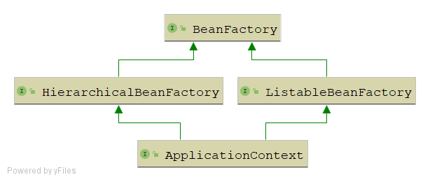

Spring官网阅读（十三）ApplicationContext详解（下）

> 在前面两篇文章中，我们已经对ApplicationContext的大部分内容做了介绍，包括国际化，Spring中的运行环境，Spring中的资源，Spring中的事件监听机制，还剩唯一一个BeanFactory相关的内容没有介绍，这篇文章我们就来介绍BeanFactory，这篇文章结束，关于ApplicationContext相关的内容我们也总算可以告一段落了。本文对应官网中的`1.16`及`1.15`小结

前面我们也提到了ApplicationContext继承了BeanFactory接口，其继承关系如下：



下面我们直接进入BeanFactory相关内容的学习

# BeanFactory

## 接口定义

```java
public interface BeanFactory {
	
    // FactroyBean的前缀，如果getBean的时候BeanName有这个前缀，会去获取对应的FactroyBean
    // 而不是获取FactroyBean的getObject返回的Bean
	String FACTORY_BEAN_PREFIX = "&";
	
    // 都是用于获取指定的Bean，根据名称获取指定类型获取
	Object getBean(String name) throws BeansException;
	<T> T getBean(String name, Class<T> requiredType) throws BeansException;
	Object getBean(String name, Object... args) throws BeansException;
	<T> T getBean(Class<T> requiredType) throws BeansException;
	<T> T getBean(Class<T> requiredType, Object... args) throws BeansException;
	
    // 获取指定的Bean的ObjectProvider,这个有个问题，ObjectProvider是什么？请参考我《Spring杂谈》相关文章
    <T> ObjectProvider<T> getBeanProvider(Class<T> requiredType);
	<T> ObjectProvider<T> getBeanProvider(ResolvableType requiredType);
	
    // 检查容器中是否含有这个名称的Bean
	boolean containsBean(String name);
	
    // 判断指定的Bean是否为单例
	boolean isSingleton(String name) throws NoSuchBeanDefinitionException;
	
    // 判断指定的Bean是否为原型
	boolean isPrototype(String name) throws NoSuchBeanDefinitionException;
	
    // 判断指定的Bean类型是否匹配，关于ResolvableType我已经专门写文章介绍过了，请参考我《Spring杂谈》相关文章
	boolean isTypeMatch(String name, ResolvableType typeToMatch) throws NoSuchBeanDefinitionException;
	boolean isTypeMatch(String name, Class<?> typeToMatch) throws NoSuchBeanDefinitionException;
	
    // 返回指定Bean的类型
	Class<?> getType(String name) throws NoSuchBeanDefinitionException;
	
    // 返回指定Bean的别名
	String[] getAliases(String name);

}
```


## 继承关系


## 接口功能


# 常见的ApplicationContext之间的区别