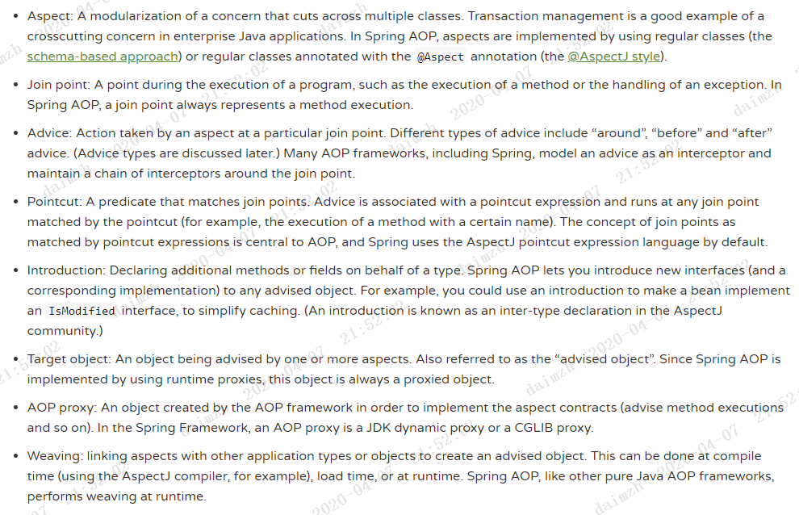

Spring官网阅读（十八）Spring中AOP

**鲁班学院：戴明智（D55）**

> 本篇文章将作为整个Spring官网阅读笔记的最后一篇。如果要谈`SpringFramework`必定离不开两点
>
> 1. `IOC`（控制反转）
> 2. `AOP`（面向切面）
>
> 在前面的文章中我们已经对`IOC`做过详细的介绍了，本文主要介绍`AOP`，关于其中的源码部分将在专门的源码专题介绍，本文主要涉及的是`AOP`的基本概念以及如何使用,本文主要涉及到官网中的第5、6两大章

# 什么是AOP

> `AOP`为Aspect Oriented Programming的缩写，意为：[面向切面编程](https://baike.baidu.com/item/面向切面编程/6016335)，通过[预编译](https://baike.baidu.com/item/预编译/3191547)方式和运行期间动态代理实现程序功能的统一维护的一种技术。`AOP`是[OOP](https://baike.baidu.com/item/OOP)的延续，是软件开发中的一个热点，也是[Spring](https://baike.baidu.com/item/Spring)框架中的一个重要内容，是[函数式编程](https://baike.baidu.com/item/函数式编程/4035031)的一种衍生范型。利用`AOP`可以对业务逻辑的各个部分进行隔离，从而使得业务逻辑各部分之间的[耦合度](https://baike.baidu.com/item/耦合度/2603938)降低，提高程序的可重用性，同时提高了开发的效率。
>
> ​																																		------------------《百度百科》

可能你看完上面这段话还是迷迷糊糊，一堆专业词汇看起来很牛逼的样子，不用担心，任何东西都是需要积累的，有些东西只需要记在脑子里，在以后实践的过程中自然而然的就明白了。

另外放一段网上大佬写的一段话，我觉得很好的解释了面向对象跟面向切面

> 面向对象编程**解决了业务模块的封装复用**的问题，但是对于某些模块，其本身并不独属于摸个业务模块，而是根据不同的情况，贯穿于某几个或全部的模块之间的。例如登录验证，其只开放几个可以不用登录的接口给用户使用（一般登录使用拦截器实现，但是其切面思想是一致的）；再比如性能统计，其需要记录每个业务模块的调用，并且监控器调用时间。可以看到，**这些横贯于每个业务模块的模块，如果使用面向对象的方式，那么就需要在已封装的每个模块中添加相应的重复代码**，对于这种情况，面向切面编程就可以派上用场了。
>
> 面向切面编程，指的是将一定的切面逻辑按照一定的方式编织到指定的业务模块中，从而将这些业务模块的调用包裹起来

# AOP中的核心概念

官网中的相关介绍如下：



是不是看得头皮发麻，不用紧张，我们一点点看过去就好了，现在从上往下开始介绍

> 前置场景，假设我们现在要对所有的controller层的接口进行性能监控

## 切面

> 切点跟通知组成了切面

##　连接点

> 所有我们能够将通知应用到的地方都是连接点，在Spring中，我们可以认为连接点就是所有的方法（除构造函数外），连接点没有什么实际意义，这个概念的提出只是为了更好的说明切点

## 通知

>  就是我们想要额外实现的功能，在上面的例子中，实现了性能监控的方法就是通知

## 切点

> 在连接点的基础上，来定义切入点，比如在我们上面的场景中，要对controller层的所有接口完成性能监控，那么就是说所有controller中的方法就是我们的切点（service层，dao层的就是普通的连接点，没有什么作用）。

## 引入

> 我们可以让代理类实现目标类没有实现的额外的接口以及持有新的字段。

## 目标对象

> 引入中所提到的目标类，也就是要被通知的对象，也就是真正的业务逻辑，他可以在毫不知情的情况下，被织入切面，而自己专注于业务本身的逻辑。

## 代理对象

> 将切面织入目标对象后所得到的就是代理对象。代理对象是正在具备通知所定义的功能，并且被引入了的对象。

## 织入

> 把切面应用到目标对象来创建新的代理对象的过程。切面的织入有三种方式
>
> 1. 编译时织入
> 2. 类加载时期织入
> 3. 运行时织入
>
> 我们通常使用的`SpringAOP`都是编译时期织入，另外Spring中也提供了一个Load Time Weaving
> （`LTW`，加载时期织入）的功能，此功能使用较少，有兴趣的同学可以参考一下两个链接：
>
> - https://www.cnblogs.com/wade-luffy/p/6073702.html
> - https://docs.spring.io/spring/docs/5.1.14.BUILD-SNAPSHOT/spring-framework-reference/core.html#aop-aj-ltw

------

> *上面这些名词希望你不仅能记住而且要能理解，因为不管是Spring源码还是官网中都使用了这些名词，并且从这些名称中还衍生了一些新的名词，比如：`Advisor`，虽然这些在源码阶段会再介绍，不过如果现在能懂的话无疑就在为学习源码减负了。*

在对`AOP`中的核心概念有了一定了解之后，我们就来看看，如何使用`AOP`，在学习使用时，第一步我们需要知道怎么去在容器中申明上面所说的那些`AOP`中的元素

# Spring中如何使用AOP

> XML方式本文不再介绍了，笔者近两年来没有通过XML的方式来使用过SpringAOP，现在注解才是王道，本文也只会介绍注解的方式

## 1、开启AOP

```java
@Configuration
@ComponentScan("com.spring.study.springfx.aop")
// 开启AOP
@EnableAspectJAutoProxy
public class Config {
}
```

核心点就是在配置类上添加`@EnableAspectJAutoProxy`,这个注解中有两个属性如下：

```java
@Target(ElementType.TYPE)
@Retention(RetentionPolicy.RUNTIME)
@Documented
@Import(AspectJAutoProxyRegistrar.class)
public @interface EnableAspectJAutoProxy {
	// 是否使用CGLIB代理，默认不使用。默认使用JDK动态代理
	boolean proxyTargetClass() default false;
	
    // 是否将代理类作为线程本地变量（threadLocal）暴露（可以通过AopContext访问）
    // 主要设计的目的是用来解决内部调用的问题
	boolean exposeProxy() default false;

}
```

## 2、申明切面

```java
@Aspect  // 申明是一个切面
@Component  // 切记，一定要将切面交由Spring管理，否则不起作用
public class DmzAnnotationAspect {
	//......
}
```

## 3、申明切点

> 我们一般都会通过切点表达式来申明切点，切点表达式一般可以分为以下几种

#### 切点表达式

##### excecution表达式

###### 语法

> `execution(modifiers-pattern? ret-type-pattern declaring-type-pattern?name-pattern(param-pattern) throws-pattern?)`

这里问号表示当前项是非必填的，其中各项的语义如下：

- modifiers-pattern（**非必填**）：方法的可见性，如public，protected；
- ret-type-pattern（**必填**）：方法的返回值类型，如int，void等；
- declaring-type-pattern（**非必填**）：方法所在类的全路径名，如com.spring.Aspect；
- name-pattern（**必填**）：方法名类型，如buisinessService()；
- param-pattern（**必填**）：方法的参数类型，如java.lang.String；
- throws-pattern（**非必填**）：方法抛出的异常类型，如java.lang.Exception；

可以看到，必填的参数只有三个，**返回值**，**方法名**，**方法参数**。

###### 示例

按照上面的语法，我们可以定义如下的切点表达式

> ```java
> // 1.所有权限为public的，返回值不限，方法名称不限，方法参数个数及类型不限的方法，简而言之，所有public的方法
> execution(public * *(..))
> 
> // 2.所有权限为public的，返回值限定为String的，方法名称不限，方法参数个数及类型不限的方法
> execution(public java.lang.String *(..)) 
> 
> // 3.所有权限为public的，返回值限定为String的，方法名称限定为test开头的，方法参数个数及类型不限的方法
> execution(public java.lang.String test*(..))
>     
> // 4.所有权限为public的，返回值限定为String的，方法所在类限定为com.spring.study.springfx.aop.service包下的任意类，方法名称限定为test开头的，方法参数个数及类型不限的方法
> execution(public java.lang.String com.spring.study.springfx.aop.service.*.test*(..))
>         
> // 5.所有权限为public的，返回值限定为String的，方法所在类限定为com.spring.study.springfx.aop.service包及其子包下的任意类，方法名称限定为test开头的，方法参数个数及类型不限的方法
> execution(public java.lang.String com.spring.study.springfx.aop.service..*.test*(..))
>     
> // 6.所有权限为public的，返回值限定为String的，方法所在类限定为com.spring.study.springfx.aop.service包及其子包下的Dmz开头的类，方法名称限定为test开头的，方法参数个数及类型不限的方法
> execution(public java.lang.String com.spring.study.springfx.aop.service..Dmz*.test*(..))
>     
> // 7.所有权限为public的，返回值限定为String的，方法所在类限定为com.spring.study.springfx.aop.service包及其子包下的Dmz开头的类，方法名称限定为test开头的，方法参数限定第一个为String类，第二个不限但是必须有两个参数
> execution(public java.lang.String com.spring.study.springfx.aop.service..Dmz*.test*(String,*))
> 
> // 8.所有权限为public的，返回值限定为String的，方法所在类限定为com.spring.study.springfx.aop.service包及其子包下的Dmz开头的类，方法名称限定为test开头的，方法参数限定第一个为String类，第二个可有可无并且不限定类型
> execution(public java.lang.String com.spring.study.springfx.aop.service..Dmz*.test*(String,..))
> ```

看完上面的例子不知道大家有没有疑问，比如为什么修饰符一直是`public`呢？其它修饰符行不行呢？修饰符的位置能不能写成`*`这种形式呢？

> 答：
>
> 1. 如果使用的是JDK动态代理，这个修饰符必须是public，因为JDK动态代理是针对于目标类实现的接口进行的，接口的实现方法必定是public的。
> 2. 如果不使用JDK动态代理而使用CGLIB代理（`@EnableAspectJAutoProxy(proxyTargetClass = true)`）那么修饰符还可以使用protected或者默认修饰符。但是不能使用private修饰符，因为CGLIB代理生成的代理类是继承目标类的，private方法子类无法复写，自然也无法代理。基于此，修饰符是不能写成`*`这种格式的。

##### @annotation表达式

###### 语法

> @annotation(annotation-type)

###### 示例

> ```java
> // 代表所有被DmzAnnotation注解所标注的方法
> // 使用注解的方法定义切点一般会和自定义注解配合使用
> @annotation(com.spring.study.springfx.aop.annotation.DmzAnnotation)
> ```

##### within表达式

###### 语法

> within(declaring-type-pattern)

###### 示例

> ```java
> // within表达式只能指定到类级别，如下示例表示匹配com.spring.service.BusinessObject中的所有方法
> within(com.spring.service.BusinessObject)
>     
> // within表达式能够使用通配符，如下表达式表示匹配com.spring.service包（不包括子包）下的所有类
> within(com.spring.service.*)        
> 
> // within表达式能够使用通配符，如下表达式表示匹配com.spring.service包及子包下的所有类
> within(com.spring.service..*)    
> ```

*官网中一共给出了9中切点表达式的定义方式，但是实际上我们常用的就两种，就是`excecution表达式`以及`annotation表达式`。所以下文对于其余几种本文就不做详细的介绍了，大家有兴趣的可以了解，没有兴趣的可以直接跳过。可以参考[官网链接](https://docs.spring.io/spring/docs/5.1.14.BUILD-SNAPSHOT/spring-framework-reference/core.html#aop-pointcuts-designators)*

##### @within表达式

###### 语法

> @within(annotation-type)

跟`annotation表达式`的区别在于，`annotation表达式`是面向方法的，表示匹配带有指定注解的方法，而`within表达式`是面向类的，表示匹配带有指定注解的类。

###### 示例

> ```java
> // 代表所有被DmzAnnotation注解所标注的类
> // 使用注解的方法定义切点一般会和自定义注解配合使用
> @within(com.spring.study.springfx.aop.annotation.DmzAnnotation)
> ```

##### arg表达式

###### 语法

> args(param-pattern)

###### 示例

> ```java
> // 匹配所有只有一个String类型的方法
> args(String)
> // 匹配所有有两个参数并且第一个参数为String的方法
> args(String,*)
> // 匹配所有第一个参数是String类型参数的方法
> args(String,..)
> ```

##### @args表达式

###### 语法

> @args(annotation-type)

###### 示例

> @args(com.spring.annotation.FruitAspect)

跟`@annotation表达式`以及`@within表达式`类似，`@annotation表达式`表示匹配使用了指定注解的方法，`@within表达式`表达式表示匹配了使用了指定注解的类，而`@args表达式`则代表使用了被指定注解标注的类作为方法参数

##### this表达式

> ```java
> // 代表匹配所有代理类是AccountService的类
> this(com.xyz.service.AccountService)
> ```

##### target表达式

> ```java
> // 代表匹配所有目标类是AccountService的类
> target(com.xyz.service.AccountService)
> ```

*this跟target很鸡肋，基本用不到*

#### 定义切点

```java
@Aspect
@Component
public class DmzAnnotationAspect {
    @Pointcut("execution(public * *(..))")
    private void executionPointcut() {}
	
    @Pointcut("@annotation(com.spring.study.springfx.aop.annotation.DmzAnnotation)")
    private void annotationPointcut() { }
    
    // 可以组合使用定义好的切点
    
    // 表示同时匹配满足两者
    @Pointcut("executionPointcut() && annotationPointcut()")
    private void annotationPointcutAnd() {}
	
    // 满足其中之一即可
    @Pointcut("executionPointcut() || annotationPointcut()")
    private void annotationPointcutOr() {}
	
    // 不匹配即可
    @Pointcut("!executionPointcut()")
    private void annotationPointcutNot() {}
}
```

现在我们已经在一个切面中定义了两个切点了，现在开始编写通知

## 4、申明通知

#### 通知的类型

##### Before

> 在目标方法之前执行，如果发生异常，会阻止业务代码的执行

##### AfterReturning

>  跟Before对应，在目标方法完全执行后（return后）再执行

##### AfterThrowing

> 方法抛出异常这个通知仍然会执行（这里的方法既可以是目标方法，也可以是我们定义的通知）

##### After（Finally）

> 切记，跟Before对应的是AfterReturning，一个在目标方法还没执行前执行，一个在目标方法完全执行后（return后）再执行，这个After类型的通知类型我们在编写代码时的Finally，即使方法抛出异常这个通知仍然会执行（这里的方法既可以是目标方法，也可以是我们定义的通知）。
>
> 一般我们使用After类型的通知都是为了完成资源的释放或者其它类似的目的

##### Around

> 最强大的通知类型，可以包裹目标方法，其可以传入一个ProceedingJoinPoint用于调用业务模块的代码，无论是调用前逻辑还是调用后逻辑，都可以在该方法中编写，甚至其可以根据一定的条件而阻断业务模块的调用，可以更改目标方法的返回值

#### 实际应用

```java
@Aspect
@Component
public class DmzAnnotationAspect {
	
    // 申明的切点
    @Pointcut("execution(public * *(..))")
    private void executionPointcut() {}
    @Pointcut("@annotation(com.spring.study.springfx.aop.annotation.DmzAnnotation)")
    private void annotationPointcut() {}
	
    // 前置通知，在目标方法前调用
    @Before("executionPointcut()")
    public void executionBefore() {
        System.out.println("execution aspect Before invoke!");
    }
    
    // 后置通知，在目标方法返回后调用
    @AfterReturning("executionPointcut()")
    public void executionAfterReturning() {
        System.out.println("execution aspect AfterReturning invoke!");
    }
	
    // 最终通知，正常的执行时机在AfterReturning之前
    @After("executionPointcut()")
    public void executionAfter() {
        System.out.println("execution aspect After invoke!");
    }

 	// 异常通知，发生异常时调用
    @AfterThrowing("executionPointcut()")
    public void executionAfterThrowing() {
        System.out.println("execution aspect AfterThrowing invoke!");
    }
	
    // 环绕通知，方法调用前后都能进行处理
    @Around("executionPointcut()")
    public void executionAround(ProceedingJoinPoint pjp) throws Throwable{
        System.out.println("execution aspect Around(before) invoke!");
        System.out.println(pjp.proceed());
        System.out.println("execution aspect Around(after) invoke!");
    }
}

```


#### 通知中的参数

#### 通知的排序


# AOP的应用


## 全局异常处理器


## 接口日志


