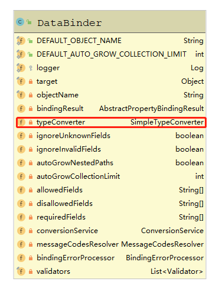
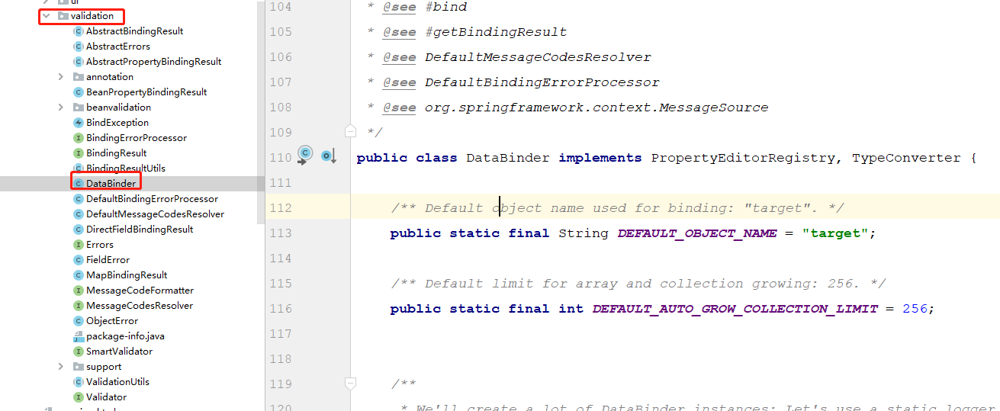
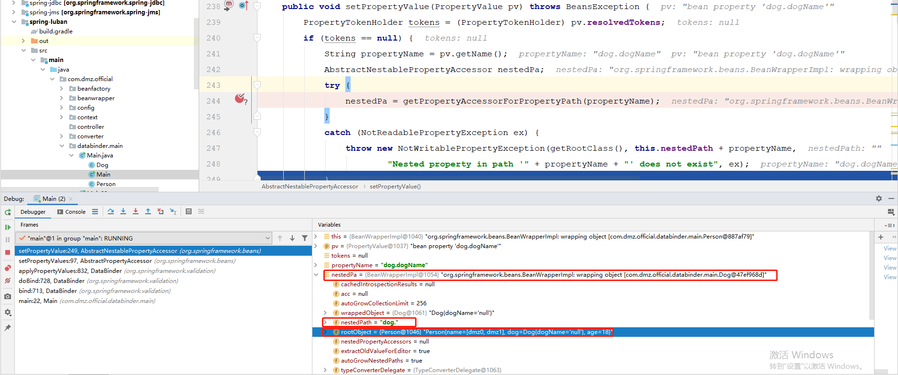

Spring官网阅读（十六）Spring中的数据绑定

**鲁班学院：戴明智（D55）**

> 在前面的文章我们学习过了Spring中的类型转换以及格式化，对于这两个功能一个很重要的应用场景就是应用于我们在XML中配置的Bean的属性值上，如下：
>
> ```xml
> <bean class="com.dmz.official.converter.service.IndexService" name="indexService">
> 		<property name="name" value="dmz"/>
>     <!-- age 为int类型-->
> 		<property name="age" value="1"/>
> </bean>
> ```
>
> 在上面这种情况下，我们从XML中解析出来的值类型肯定是String类型，而对象中的属性为int类型，当Spring将配置中的数据应用到Bean上时，就调用了我们的类型转换器完成了String类型的字面值到int类型的转换。
>
> 那么除了在上面这种情况中使用了类型转换，还有哪些地方用到了呢？对了，就是本文要介绍的数据绑定--`DataBinder`。

# DataBinder

## UML类图


从上图我们可以看到，`DataBinder`实现了`PropertyEditorRegistry`以及`TypeConverter`，所以它拥有类型转换的能力。

我们通过下面两张图对比下`BeanWrapperImpl`跟`DataBinder`

1. `DataBinder`



2. `BeanWrapperImpl`


可以发现跟`BeanWrapperImpl`不同的是，它并没有通过继承某一个类来实现类型转换，而是通过组合的方式（`DataBinder`持有一个`SimpleTypeConverter`的引用，通过这个`SimpleTypeConverter`完成了类型转换）

## 使用示例

```java
public class Main {
	public static void main(String[] args) throws BindException {
		Person person = new Person();
		DataBinder binder = new DataBinder(person, "person");
        // 创建用于绑定到对象上的属性对（属性名称，属性值）
		MutablePropertyValues pvs = new MutablePropertyValues();
		pvs.add("name", "fsx");
		pvs.add("age", 18);
		binder.bind(pvs);
		System.out.println(person);
        // 程序打印：Person{name='dmz', age=18}
	}
}

class Person {
	String name;

	int age;

	public String getName() {
		return name;
	}

	public void setName(String name) {
		this.name = name;
	}

	public int getAge() {
		return age;
	}

	public void setAge(int age) {
		this.age = age;
	}

	@Override
	public String toString() {
		return "Person{" +
				"name='" + name + '\'' +
				", age=" + age +
				'}';
	}
}
```

>在上面的例子中要明确一点，Person中必须要提供setter方法（getter方法可以不提供，因为我们只是设置值），实际上`DataBinder`底层也是同样也是采用了Java的内省机制（关于Java的内省机制如果不了解的话，请参考《Spring官网阅读十四》），而内省只会根据setter方法以及getter来设置或者获取Bean中的属性。

## 源码分析

可能有细心的同学会发现，`DataBinder`是位于我们的`org.springframework.validation`包下的，也就是说它跟Spring中的校验也有关系，不过校验相关的内容不是我们本节要探讨的，本文我们只探讨`DataBinder`跟数据绑定相关的内容。

`DataBinder`所在的包结构如下：



OK，明确了要分析的点之后，接下来我们就看看到底数据是如何绑定到我们的对象上去的，核心代码如下：

### bind方法

第一步，我们是直接调用了bind方法来完成，其代码如下：

```java
public void bind(PropertyValues pvs) {
    MutablePropertyValues mpvs = (pvs instanceof MutablePropertyValues ?
                                  (MutablePropertyValues) pvs : new MutablePropertyValues(pvs));
    // 最终调用了doBind方法，如果大家对Spring代码有所了解的话，会发现Spring中有很多doXXX的方法
    // 形如doXXX这种命名方式的方法往往就是真正“干活”的代码，对于本例来说，肯定就是它来完成数据绑定的
    doBind(mpvs);
}
```

### doBind方法

```java
protected void doBind(MutablePropertyValues mpvs) {
    // 校验
    checkAllowedFields(mpvs);
    // 校验
    checkRequiredFields(mpvs);
    // 真正进行数据绑定
    applyPropertyValues(mpvs);
}
```

跟校验相关的代码不在本文的探讨范围内，如果感兴趣的话可以关注我接下来的文章。我们现在把注意力放在`applyPropertyValues`这个方法，方法名直译过来的意思是--------应用属性值，就是将方法参数中的属性值应用到Bean上，也就是进行属性绑定。不知道大家看到这个方法名是否熟悉，如果对源码有一定了解的话，一定会知道Spring在完成属性注入的过程中调用了一个同名的方法，关于这个方法稍后我会带大家找一找然后做个比较，现在我们先看看`doBind`方法中`applyPropertyValues`干了什么

### applyPropertyValues方法

```java
protected void applyPropertyValues(MutablePropertyValues mpvs) {
    try {
        // 逻辑非常简单，获取一个属性访问器，然后直接通过属性访问器将属性值设置上去
        // IgnoreUnknownFields：忽略在Bean中找不到的属性
        // IgnoreInvalidFields：忽略找到，但是没有访问权限的值
        getPropertyAccessor().setPropertyValues(mpvs, isIgnoreUnknownFields(), isIgnoreInvalidFields());
    }
    catch (PropertyBatchUpdateException ex) {
        // 省略部分代码.....
    }
}
```

这段代码主要做了两件事

#### 获取一个属性访问器

`getPropertyAccessor()`,获取一个属性访问器，关于属性访问器在《Spring官网阅读十四》也有介绍，这里我再做一些补充


可以看到，`PropertyAccessor`（也就是我们所说的属性访问器）只有两个实现类

- 第一个，`BeanWrapperImpl`
- 第二个，`DirectFieldAccessor`

那么这两个有什么区别呢？第一个我们已经知道了，它是基于内省来实现的，所以`BeanWrapperImpl`肯定是基于getter,setter方法来实现对属性的操作的。第二个从名字上我们可以猜测，它估计是直接通过反射来获取字段的，也就是说，不需要提供setter/getter方法。大家可以自行做个测试，这里我就直接给结论了

- `BeanWrapperImpl`，基于内省，依赖getter/setter方法
- `DirectFieldAccessor`，基于反射，不需要提供getter/setter方法

那么接下来，我们思考一个问题，`DataBinder`中的`getPropertyAccessor()`访问的是哪种类型的属性访问器呢？其实结合我们之前那个使用的示例就很容易知道，它肯定返回的是一个基于内省机制实现的属性访问器，并且它就是返回了一个`BeanWrapperImpl`。代码如下：

```java
// 1.获取一个属性访问器，可以看到，是通过getInternalBindingResult()方法返回的一个对象来获取的
// 那么getInternalBindingResult()做了什么呢？
protected ConfigurablePropertyAccessor getPropertyAccessor() {
    return getInternalBindingResult().getPropertyAccessor();
}

// 2.getInternalBindingResult()又调用了一个initBeanPropertyAccess()，从名字上来看，就是用来初始化属性访问器的，再看看这个方法干了啥
protected AbstractPropertyBindingResult getInternalBindingResult() {
    if (this.bindingResult == null) {
        initBeanPropertyAccess();
    }
    return this.bindingResult;
}

// 3.调用了一个createBeanPropertyBindingResult，创建了一个对象，也就是通过创建的这个对象返回了一个属性访问器，那么这个对象是什么呢？接着往下看
public void initBeanPropertyAccess() {
    Assert.state(this.bindingResult == null,
                 "DataBinder is already initialized - call initBeanPropertyAccess before other configuration methods");
    this.bindingResult = createBeanPropertyBindingResult();
}

// 4.可以发现创建的这个对象就是一个BeanPropertyBindingResult
protected AbstractPropertyBindingResult createBeanPropertyBindingResult() {
    BeanPropertyBindingResult result = new BeanPropertyBindingResult(getTarget(),
                                                                     getObjectName(), isAutoGrowNestedPaths(), getAutoGrowCollectionLimit());
    // .....
    return result;
}

// 5.跟踪这个对象的getPropertyAccessor()方法，发现就是返回了一个beanWrapper
// 现在明朗了吧，dataBinder最终也是依赖于beanWrapper
public final ConfigurablePropertyAccessor getPropertyAccessor() {
    if (this.beanWrapper == null) {
        this.beanWrapper = createBeanWrapper();
        this.beanWrapper.setExtractOldValueForEditor(true);
        this.beanWrapper.setAutoGrowNestedPaths(this.autoGrowNestedPaths);
        this.beanWrapper.setAutoGrowCollectionLimit(this.autoGrowCollectionLimit);
    }
    return this.beanWrapper;
}
```

> 我们可以思考一个问题，为什么Spring在实现数据绑定的时候不采用`DirectFieldAccessor`而是`BeanWrapperImpl`呢？换言之，为什么不直接使用反射而使用内省呢？
>
> 我个人的理解是：反射容易打破Bean的封装性，基于内省更安全。Spring在很多地方都不推荐使用反射的方式，比如我们在使用@Autowired注解进行字段注入的时候，编译器也会提示，”Field injection is not recommended “，不推荐我们使用字段注入，最好将@Autowired添加到setter方法上。

#### 通过属性访问器直接set属性值

> 这段代码十分繁琐，如果不感兴趣可以直接跳过，整个核心就是获取到对象中的setter方法，然后反射调用。

##### 1、setPropertyValues

此方法位于`org.springframework.beans.AbstractPropertyAccessor#setPropertyValues(org.springframework.beans.PropertyValues, boolean, boolean)`

```java
public void setPropertyValues(PropertyValues pvs, boolean ignoreUnknown, boolean ignoreInvalid)
    throws BeansException {

    List<PropertyAccessException> propertyAccessExceptions = null;
    List<PropertyValue> propertyValues = (pvs instanceof MutablePropertyValues ?
                                          ((MutablePropertyValues) pvs).getPropertyValueList() : Arrays.asList(pvs.getPropertyValues()));
    for (PropertyValue pv : propertyValues) {
        try {
            // 核心代码就是这一句
            setPropertyValue(pv);
        }
		// ......
    }
```

##### 2、setPropertyValue（String,Object）

此方法位于`org.springframework.beans.AbstractNestablePropertyAccessor#setPropertyValue(java.lang.String, java.lang.Object)`

```java
public void setPropertyValue(String propertyName, @Nullable Object value) throws BeansException {
    AbstractNestablePropertyAccessor nestedPa;
    try {
        // 这里是为了解决嵌套属性的情况，比如一个person对象中，包含一个dog对象，dog对象中有一个name属性
        // 那么我们可以通过dog.name这种方式来将一个名字直接绑定到person中的dog上
        // 与此同时，我们不能再使用person的属性访问器了，因为使用dog的属性访问器，这里就是返回dog的属性访问器
        nestedPa = getPropertyAccessorForPropertyPath(propertyName);
    }
    // .......
    
    // PropertyTokenHolder是什么呢？例如我们的Person对象中有一个List<String> name的属性，
    // 那么我们在绑定时，需要对List中的元素进行赋值，所有我们会使用name[0],name[1]这种方式来进行绑定，
    // 而PropertyTokenHolder中有三个属性，其中actualName代表name,canonicalName代表整个表达式name[0],而key则代表0这个下标位置
    PropertyTokenHolder tokens = getPropertyNameTokens(getFinalPath(nestedPa, propertyName));
    // 最后通过属性访问器设置值
    nestedPa.setPropertyValue(tokens, new PropertyValue(propertyName, value));
}
```

对上面的结论进行测试，测试代码如下：

```java
public class Main {
	public static void main(String[] args) throws BindException {
		Person person = new Person();
		DataBinder binder = new DataBinder(person, "person");
		MutablePropertyValues pvs = new MutablePropertyValues();
		pvs.add("dog.dogName","dawang");
        pvs.add("name[0]", "dmz0");
		pvs.add("name[1]", "dmz1");
		pvs.add("age", 18);
		binder.bind(pvs);
		System.out.println(person);
	}
}

class Dog {
    // 省略getter/setter方法
	String dogName;
}

class Person {
    // 省略getter/setter方法
	List<String> name;
	Dog dog;
	int age;
}
```

在方法的如下位置添加条件断点（`propertyName.equals("dog.dogName")`）：


启动main方法，并开始调试，程序进入如下结果：



我们关注红框标注的三个位置

1. 第一个红框，标注了当前属性访问器所对应的对象为Dog
2. 第二个红框，这是一个特殊的`AbstractNestablePropertyAccessor`,专门用于处理嵌套属性这种情况的，所以它包含了嵌套的路径
3. 第三个红框，标注了这个嵌套的属性访问器的根对象是Person

同样的，按照这种方式我们也可以对Person中的`List<String> name`属性进行调试，可以发现`PropertyTokenHolder`就是按照上文所说的方式进行存储数据的，大家可以自行调试，我这里就不在演示了。

##### 3、setPropertyValue（PropertyTokenHolder，PropertyValue）

这个方法是对上面方法的重载，其代码仍然位于`org.springframework.beans.AbstractNestablePropertyAccessor`中，代码如下：

```java
protected void setPropertyValue(PropertyTokenHolder tokens, PropertyValue pv) throws BeansException {
    if (tokens.keys != null) {
        // 前面已经说过了，keys其实就是下标数组，如果你能看到这里的话，肯定会有一个疑问,为什么需要一个数组呢？考虑这种属性List<List<String>> list,这个时候为了表示它,是不是就要list[0][0]这种方式了呢？这个时候就需要用数组存储了，因为一个属性需要多个下标表示
        processKeyedProperty(tokens, pv);
    }
    else {
        // 我们关注这个方法即可，解析完PropertyTokenHolder后，最终都要调用这个方法
        processLocalProperty(tokens, pv);
    }
}
```

##### 4、processLocalProperty

代码位于：`org.springframework.beans.AbstractNestablePropertyAccessor#processLocalProperty`

```java
	private void processLocalProperty(PropertyTokenHolder tokens, PropertyValue pv) {
		PropertyHandler ph = getLocalPropertyHandler(tokens.actualName);
		// .... 省略部分代码
		Object oldValue = null;
		try {
			Object originalValue = pv.getValue();
			Object valueToApply = originalValue;
            // 判断成立，代表需要进行类型转换，conversionNecessary为null或者为true都成立
			if (!Boolean.FALSE.equals(pv.conversionNecessary)) {
                // 判断成立，代表已经转换过了
				if (pv.isConverted()) {
					valueToApply = pv.getConvertedValue();
				}
				else {
					if (isExtractOldValueForEditor() && ph.isReadable()) {
						try {
							oldValue = ph.getValue();
						}
		// .... 省略部分代码
					}
                    // 类型转换的部分，之前已经分析过了，这里就没什么好讲的了
					valueToApply = convertForProperty(
							tokens.canonicalName, oldValue, originalValue, ph.toTypeDescriptor());
				}
				pv.getOriginalPropertyValue().conversionNecessary = (valueToApply != originalValue);
			}
            // 核心代码就这一句
			ph.setValue(valueToApply);
		}
	// .... 省略部分代码
		}
	}
```

##### 5、setValue

代码位置：`org.springframework.beans.BeanWrapperImpl.BeanPropertyHandler#setValue`

最终进入到`BeanWrapperImpl`中的一个内部类`BeanPropertyHandler`中，方法代码如下:

```java
public void setValue(final @Nullable Object value) throws Exception {
    final Method writeMethod = (this.pd instanceof GenericTypeAwarePropertyDescriptor ?
                                ((GenericTypeAwarePropertyDescriptor) this.pd).getWriteMethodForActualAccess() :
                                this.pd.getWriteMethod());
 	// .... 省略部分代码
        ReflectionUtils.makeAccessible(writeMethod);
        writeMethod.invoke(getWrappedInstance(), value);
    }
}
```

代码就是这么的简单，内省获取这个属性的`writeMethod`，其实就是`setter`方法，然后直接反射调用

------

在了解了`DataBinder`之后，我们再来学习跟基于`DataBinder`实现的子类

# DataBinder的子类

## 子类概览


可以看到`DataBinder`的直接子类只有一个`WebDataBinder`，从名字上我们就能知道，这个类主要作用于Web环境，从而也说明了数据绑定主要使用在Web环境中。

### WebDataBinder

> 这个接口是为了Web环境而设计的，但是并不依赖任何的`Servlet API`。它主要的作用是作为一个基类让其它的类继承，例如`ServletRequestDataBinder`。

#### 代码分析

```java
public class WebDataBinder extends DataBinder {
	
    // 这两个字段的详细作用见下面的两个方法checkFieldDefaults/checkFieldMarkers
	public static final String DEFAULT_FIELD_MARKER_PREFIX = "_";
	public static final String DEFAULT_FIELD_DEFAULT_PREFIX = "!";
	@Nullable
	private String fieldMarkerPrefix = DEFAULT_FIELD_MARKER_PREFIX;
	@Nullable
	private String fieldDefaultPrefix = DEFAULT_FIELD_DEFAULT_PREFIX;

    // ......省略构造方法及一些getter/setter方法

	@Override
	protected void doBind(MutablePropertyValues mpvs) {
		checkFieldDefaults(mpvs);
		checkFieldMarkers(mpvs);
        // 没有对数据绑定做什么扩展，只是单纯的调用了父类的方法，也就是DataBinder的方法
		super.doBind(mpvs);
	}
	

    // 若你给定的PropertyValue的属性名是以!开头的，例如，传入的属性名称为：!name,属性值为：dmz
    // 那就做处理如下：
    // 如果Bean中的name属性是可写的并且mpvs不存在name属性，那么向mpvs中添加一个属性对，其中属性名称为name,值为dmz
    // 然后将!name这个属性值对从mpvs中移除
    // 其实这里就是说你可以使用！来给个默认值。比如!name表示若找不到name这个属性的时，就取它的值，
    // 也就是说你request里若有穿!name保底，也就不怕出现null值啦
	protected void checkFieldDefaults(MutablePropertyValues mpvs) {
		String fieldDefaultPrefix = getFieldDefaultPrefix();
		if (fieldDefaultPrefix != null) {
			PropertyValue[] pvArray = mpvs.getPropertyValues();
			for (PropertyValue pv : pvArray) {
				if (pv.getName().startsWith(fieldDefaultPrefix)) {
					String field = pv.getName().substring(fieldDefaultPrefix.length());
                    // 属性可写，并且当前要绑定的属性值中不包含这个去除了“!”的属性名
					if (getPropertyAccessor().isWritableProperty(field) && !mpvs.contains(field)) {
                        // 添加到要绑定到Bean中的属性值集合里
						mpvs.add(field, pv.getValue());
					}
					mpvs.removePropertyValue(pv);
				}
			}
		}
	}
    
    // 处理_的步骤
    // 若传入的字段以“_”开头，以属性名称：“_name”，属性值dmz为例
    // 如果Bean中的name字段可写，并且mpvs没有这个值
    // 那么对Bean中的name字段赋默认的空值，比如Boolean类型默认给false，数组给空数组[]，集合给空集合，Map给空map 
    // 然后移除mpvs中的“_name”
    // 相当于说，当我们进行数据绑定时，传入“_name”时，如果没有传入具体的属性值，Spring会为我们赋默认的空值
    // 前提是必须以“_”开头
	protected void checkFieldMarkers(MutablePropertyValues mpvs) {
		String fieldMarkerPrefix = getFieldMarkerPrefix();
		if (fieldMarkerPrefix != null) {
			PropertyValue[] pvArray = mpvs.getPropertyValues();
			for (PropertyValue pv : pvArray) {
				if (pv.getName().startsWith(fieldMarkerPrefix)) {
					String field = pv.getName().substring(fieldMarkerPrefix.length());
					if (getPropertyAccessor().isWritableProperty(field) && !mpvs.contains(field)) {
						Class<?> fieldType = getPropertyAccessor().getPropertyType(field);
						mpvs.add(field, getEmptyValue(field, fieldType));
					}
					mpvs.removePropertyValue(pv);
				}
			}
		}
	}

	@Nullable
	protected Object getEmptyValue(String field, @Nullable Class<?> fieldType) {
		return (fieldType != null ? getEmptyValue(fieldType) : null);
	}
	
    // 根据不同的类型给出空值
	@Nullable
	public Object getEmptyValue(Class<?> fieldType) {
		try {
           // 布尔值，默认false
			if (boolean.class == fieldType || Boolean.class == fieldType) {
				return Boolean.FALSE;
			}
            // 数组，默认给一个长度为0的符合要求的类型的数组 
			else if (fieldType.isArray()) {
				return Array.newInstance(fieldType.getComponentType(), 0);
			}
            // 集合，也是给各种空集合，Set/List等等
			else if (Collection.class.isAssignableFrom(fieldType)) {
				return CollectionFactory.createCollection(fieldType, 0);
			}
			else if (Map.class.isAssignableFrom(fieldType)) {
				return CollectionFactory.createMap(fieldType, 0);
			}
		}
		catch (IllegalArgumentException ex) {
			if (logger.isDebugEnabled()) {
				logger.debug("Failed to create default value - falling back to null: " + ex.getMessage());
			}
		}
		// Default value: null.
		return null;
	}
	
    // 这个方法表示，支持将文件作为属性绑定到对象的上
	protected void bindMultipart(Map<String, List<MultipartFile>> multipartFiles, MutablePropertyValues mpvs) {
		multipartFiles.forEach((key, values) -> {
			if (values.size() == 1) {
				MultipartFile value = values.get(0);
				if (isBindEmptyMultipartFiles() || !value.isEmpty()) {
					mpvs.add(key, value);
				}
			}
			else {
				mpvs.add(key, values);
			}
		});
	}

}
```

可以看到相对于父类`DataBinder`，它主要做了以下三点增强

1. 可以手动为Bean中的属性提供默认值（提供“!”开头的属性名称）
2. 可以让容器对属性字段赋上某些空值（提供“_”开头的属性名称）
3. 可以将文件绑定到Bean上

#### 使用示例

```java
public class WebDataBinderMain {
	public static void main(String[] args) {
		A  a = new A();
		WebDataBinder webDataBinder = new WebDataBinder(a);
		MutablePropertyValues propertyValues = new MutablePropertyValues();
		// propertyValues.add("name","I AM dmz");
		propertyValues.add("!name","dmz");
		propertyValues.add("_list","10");
		webDataBinder.bind(propertyValues);
		System.out.println(a);
        // 程序打印：
       // A{name='dmz', age=0, multipartFile=null, list=[], no_list=null}
       // 如果注释打开，程序打印：A{name='I AM dmz', age=0, multipartFile=null, list=[], no_list=null}
	}
}

// 省略getter/setter方法
class A{
	String name;
	int age;
	MultipartFile multipartFile;
	List<String> list;
	List<String> no_list;
	}
}
```

### ServletRequestDataBinder

> 相比于父类，明确的依赖了`Servlet API`，会从`ServletRequest`中解析出参数，然后绑定到对应的Bean上，同时还能将文件对象绑定到Bean上。

#### 代码分析

```java
public class ServletRequestDataBinder extends WebDataBinder {

	public void bind(ServletRequest request) {
        // 从request中解析除MutablePropertyValues，用于后面的数据绑定
		MutablePropertyValues mpvs = new ServletRequestParameterPropertyValues(request);
		
        // 如果是一个MultipartRequest，返回一个MultipartRequest
        // 上传文件时，都是使用MultipartRequest来封装请求
        MultipartRequest multipartRequest = WebUtils.getNativeRequest(request, MultipartRequest.class);
        
        // 说明这个请求对象是一个MultipartRequest
		if (multipartRequest != null) {
            
            // 调用父类方法绑定对应的文件
			bindMultipart(multipartRequest.getMultiFileMap(), mpvs);
		}
        // 留给子类扩展使用
		addBindValues(mpvs, request);
        
        // 调用WebDataBinder的doBind方法进行数据绑定
		doBind(mpvs);
	}

	protected void addBindValues(MutablePropertyValues mpvs, ServletRequest request) {
	}
	//....... 省略部分代码

}
```

### ExtendedServletRequestDataBinder

#### 代码分析

```java
public class ExtendedServletRequestDataBinder extends ServletRequestDataBinder {
	// ....省略构造方法
   
    // 这个类在ServletRequestDataBinder复写了addBindValues方法，在上面我们说过了，本身这个方法也是ServletRequestDataBinder专门提供了用于子类复写的方法
    @Override
    @SuppressWarnings("unchecked")
    protected void addBindValues(MutablePropertyValues mpvs, ServletRequest request) {
        String attr = HandlerMapping.URI_TEMPLATE_VARIABLES_ATTRIBUTE;
        // 它会从request获取名为HandlerMapping.URI_TEMPLATE_VARIABLES_ATTRIBUTE的属性
        // 我们在使用@PathVariable的时候，解析出来的参数就放在request中的这个属性上，然后由ExtendedServletRequestDataBinder完成数据绑定
        Map<String, String> uriVars = (Map<String, String>) request.getAttribute(attr);
        if (uriVars != null) {
            uriVars.forEach((name, value) -> {
                if (mpvs.contains(name)) {
                    if (logger.isWarnEnabled()) {
                        logger.warn("Skipping URI variable '" + name +
                                    "' because request contains bind value with same name.");
                    }
                }
                else {
                    mpvs.addPropertyValue(name, value);
                }
            });
        }
    }

}
```

### WebExchangeDataBinder

> 这个绑定器用于web-flux响应式编程中，用于完成Mono类型的数据的绑定，最终绑定的动作还是调用的父类的doBind方法

### MapDataBinder

>  它位于`org.springframework.data.web`是和Spring-Data相关，专门用于处理`target`是`Map`类型的目标对象的绑定，它并非一个public类，Spring定义的用于内部使用的类

### WebRequestDataBinder

> 它是用于处理Spring自己定义的`org.springframework.web.context.request.WebRequest`的，旨在处理和容器无关的web请求数据绑定

# 总结

上面关于Web相关的数据绑定我没有做详细的介绍，毕竟当前的学习阶段的重点是针对Spring-Framework，对于Web相关的东西目前主要以了解为主，后续在完成SpringMVC相关文章时会对这部分做详细的介绍。

本文主要介绍了DataBinder的整个体系，重点学习了它的数据绑定相关的知识，但是不要忘记了，它本身也可以实现类型转换的功能。实际上，我们也可以这样理解，之所以要让DataBinder具备类型转换的能力，正是为了更好的完成数据绑定。

前文我们也提到了，DataBinder位于`org.springframework.validation`，所以它必定跟校验有关，具体有什么关系呢？下篇文章将详细介绍及分析Spring中的数据校验，它也将是整个SpringFramwork官网阅读笔记的最后一篇文章！