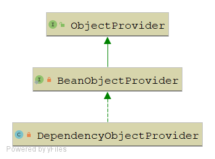

什么是ObjectFactory？什么是ObjectProvider？

> 在Spring的学习过程中，总是学的越多，不懂的越多。本来只是想将ApplicationContext的相关内容全部梳理一遍，结果发现涉及的东西越来越多，比如上篇文章中的ResolvableType，到这篇文章介绍的ObjectFactory跟ObjectProvider。不过想想也没办法，一步一步往前走呗，在这个过程中也确实学到了很多东西。废话不多说，直接进入正文。

# ObjectFactory

## 接口定义

```java
// 一个对象工厂
public interface ObjectFactory<T> {

    // 返回一个对象
    T getObject() throws BeansException;

}
```

这个接口的定义非常简单，就是一个对象工厂，定义了一个返回对象的工厂方法。回顾我们直接介绍过的一个内容`FactroyBean`，其接口定义如下：

```java
public interface FactoryBean<T> {

	@Nullable
	T getObject() throws Exception;

	@Nullable
	Class<?> getObjectType();

	default boolean isSingleton() {
		return true;
	}

}
```

可以看到两者都有一个`getObject`方法，那么它们有什么区别或者联系呢？

## 跟FactoryBean的区别及联系

### 联系

二者在功能设计上是没有什么联系的，他们最大的共同点就是都采用了工厂模式，通过工厂模式来返回一个对象

### 区别

1. `FactoryBean`在`BeanFacotry`的实现中有着特殊的处理，如果一个对象实现了`FactoryBean` 那么通过它get出来的对象实际是`factoryBean.getObject() `得到的对象，如果想得到`FactoryBean`必须通过在 `'&' + beanName `的方式获取

2. `FactoryBean`的设计主要是为了进行扩展容器中Bean的创建方式，所以FactoryBean着重于自定义创建对象过程，同时`FactoryBean`都会放到容器中，`FactoryBean`所创建的Bean也会放入容器中

3. `ObjectFactory`则只是一个普通的对象工厂接口。在Spring中主要两处用了它

   - Scope接口中的get方法，需要传入一个`ObjectFactory`，如下：

   ```java
   Object get(String name, ObjectFactory<?> objectFactory);
   ```

   这个方法的目的就是从对于的域中获取到指定名称的对象。为什么要传入一个objectFactory呢？主要是为了方便我们扩展自定义的域，而不是仅仅使用request，session等域。

   - ConfigurableListableBeanFactory类中的registerResolvableDependency方法，其定义如下，

   ```java
   void registerResolvableDependency(Class<?> dependencyType, @Nullable Object autowiredValue);
   ```

   粗看起来，好像这个方法跟`ObjectFactory`没有什么关联，但是我们留意这个方法上面的JavaDoc，其中有一段关于参数autowiredValue的介绍，如下

   > ```java
   > @param autowiredValue the corresponding autowired value. This may also be an* implementation of the {@link org.springframework.beans.factory.ObjectFactory}* interface, which allows for lazy resolution of the actual target value.
   > ```

   从这段内容中我们能知道，`autowiredValue`这个参数可能就是一个`ObjectFactory`，主要是为了让注入点能够被延迟注入。Spring通过这种方式注入了request,response等对象

   ```java
   beanFactory.registerResolvableDependency(ServletRequest.class, new RequestObjectFactory());
   beanFactory.registerResolvableDependency(ServletResponse.class, new ResponseObjectFactory());
   beanFactory.registerResolvableDependency(HttpSession.class, new SessionObjectFactory());
   beanFactory.registerResolvableDependency(WebRequest.class, new WebRequestObjectFactory());
   ```

   我们看看RequestObjectFactory的定义：

   ```java
   private static class RequestObjectFactory implements ObjectFactory<ServletRequest>, Serializable {
   
       @Override
       // 是从当前线程中获取的
       public ServletRequest getObject() {
           return currentRequestAttributes().getRequest();
       }
   
       @Override
       public String toString() {
           return "Current HttpServletRequest";
       }
   }
   ```

   当我们在某一个类中如果注入了ServletRequest对象，并不会直接创建一个ServletRequest然后注入进去，而是注入一个代理类，代理类中的方法是通过`ObjectFactoryDelegatingInvocationHandler`实现的，而这个对象中会持有一个RequestObjectFactory对象。基于此，我们可以通过下面这种方式直接注入request对象，并且保证线程安全

   ```java
   
   @RestController
   public class AutowiredRequestController {
    
       @Autowired
       private HttpServletRequest request;
   }
   ```

# ObjectProvider

## 接口定义

```java
// 1.可以看到ObjectProvider本身继承了ObjectFactory接口，所以它本身就是一个ObjectFactory
// 2.从5.1之后，这个接口还多继承了一个Iterable接口，意味着能对它进行迭代以及流式操作
public interface ObjectProvider<T> extends ObjectFactory<T>, Iterable<T> {

	// 返回用指定参数创建的bean, 如果容器中不存在, 抛出异常
	T getObject(Object... args) throws BeansException;

	// 如果指定类型的bean注册到容器中, 返回 bean 实例, 否则返回 null
	@Nullable
	T getIfAvailable() throws BeansException;

	// 如果返回对象不存在，则用传入的Supplier获取一个Bean并返回，否则直接返回存在的对象
	default T getIfAvailable(Supplier<T> defaultSupplier) throws BeansException {
		T dependency = getIfAvailable();
		return (dependency != null ? dependency : defaultSupplier.get());
	}

	 // 消费对象的一个实例（可能是共享的或独立的），如果存在通过Consumer回调消耗目标对象。
     // 如果不存在则直接返回
	default void ifAvailable(Consumer<T> dependencyConsumer) throws BeansException {
		T dependency = getIfAvailable();
		if (dependency != null) {
			dependencyConsumer.accept(dependency);
		}
	}

	// 如果不可用或不唯一（没有指定primary）则返回null。否则，返回对象。
	@Nullable
	T getIfUnique() throws BeansException;

	// 如果不存在唯一对象，则调用Supplier的回调函数
	default T getIfUnique(Supplier<T> defaultSupplier) throws BeansException {
		T dependency = getIfUnique();
		return (dependency != null ? dependency : defaultSupplier.get());
	}

	// 如果存在唯一对象，则消耗掉该对象
	default void ifUnique(Consumer<T> dependencyConsumer) throws BeansException {
		T dependency = getIfUnique();
		if (dependency != null) {
			dependencyConsumer.accept(dependency);
		}
	}

	// 返回符合条件的对象的Iterator，没有特殊顺序保证（一般为注册顺序）
	@Override
	default Iterator<T> iterator() {
		return stream().iterator();
	}

	// 返回符合条件对象的连续的Stream，没有特殊顺序保证（一般为注册顺序）
	default Stream<T> stream() {
		throw new UnsupportedOperationException("Multi element access not supported");
	}

	// 返回符合条件对象的连续的Stream。在标注Spring应用上下文中采用@Order注解或实现Order接口的顺序
	default Stream<T> orderedStream() {
		throw new UnsupportedOperationException("Ordered element access not supported");
	}
}
```

## 接口分析

在Spring4.3之前，如果你*构造函数*中要依赖另外一个bean，你必须显示依赖`@Autowired`（*这里不考虑使用了自动注入的方式，关于自动注入跟精确注入请参我之前的文章，《Spring官网阅读》系列第二，三篇*） ,像这样子

```java
@Service
public class FooService {
    private final FooRepository repository;
    @Autowired
    public FooService(FooRepository repository) {
        this.repository = repository
    }
}
```

而在4.3版本之后，已经不需要这么做了，只要我们只提供了一个构造函数，并且构造函数所需要的参数都在Spring容器中（*实际上官网中也指出，如果依赖关系是强制的，那么最好使用构造函数进行注入*），那么不需要进行精确的指定使用`@Autowired`。相比于4.3版本这无疑简化了我们的开发，但是这种隐式的注入仍然存在一些不足。例如，就上面的例子而言，如果容器中存在了一个以上的FooRepository甚至一个都没有的情况下，抛出异常

>Parameter 0 of constructor in com.example.demo.FooServicerequired a bean of type 'com.example.demo.FooRepository' that could not be found.
>
>或者是
>
>No qualifying bean of type 'com.example.demo.FooRepository'' available: expected single matching bean but found 2:

那么我们有什么办法解决它呢？基于这个原因，`ObjectProvider`就出场了。如果注入实例为空时，使用ObjectProvider则避免了强依赖导致的依赖对象不存在异常；如果有多个实例，ObjectProvider的方法可以根据Bean实现的Ordered接口或@Order注解指定的先后顺序获取一个Bean。从而了提供了一个更加宽松的依赖注入方式。Spring主要在`org.springframework.beans.factory.support.DefaultListableBeanFactory#resolveDependency`方法中使用了它，具体代码如下：

```java
@Override
public Object resolveDependency(DependencyDescriptor descriptor, String requestingBeanName, Set<String> autowiredBeanNames, @Nullable TypeConverter typeConverter) throws BeansException {
	// descriptor代表当前需要注入的那个字段，或者方法的参数，也就是注入点
    // ParameterNameDiscovery用于解析方法参数名称
    descriptor.initParameterNameDiscovery(getParameterNameDiscoverer());
    // 1. Optional<T>
    if (Optional.class == descriptor.getDependencyType()) {
        return createOptionalDependency(descriptor, requestingBeanName);
    // 2. ObjectFactory<T>、ObjectProvider<T>
    } else if (ObjectFactory.class == descriptor.getDependencyType() ||
             ObjectProvider.class == descriptor.getDependencyType()) {
        return new DependencyObjectProvider(descriptor, requestingBeanName);
    // 3. javax.inject.Provider<T>
    } else if (javaxInjectProviderClass == descriptor.getDependencyType()) {
        return new Jsr330Factory().createDependencyProvider(descriptor, requestingBeanName);
    } else {
        // 4. @Lazy
        Object result = getAutowireCandidateResolver().getLazyResolutionProxyIfNecessary(
            descriptor, requestingBeanName);
        // 5. 正常情况
        if (result == null) {
            result = doResolveDependency(descriptor, requestingBeanName, autowiredBeanNames, typeConverter);
        }
        return result;
    }
}
```

其实不管是上面的哪个情况，最终都会调用到正常情况下的`doResolveDependency`方法中。我们着重关注上面的第二种情况，可以看到当注入点为`ObjectFactory`或者`ObjectProvider`时，会new一个`DependencyObjectProvider`返回出去，那么返回的这个`DependencyObjectProvider`是什么呢？

其继承关系如下：



这个`DependencyObjectProvider`对象，其实就是一个`ObjectProvider`，我们看看它是如何实现`ObjectProvider`中的方法的（方法的实现逻辑都差不多，这里就看一个方法）：

```java
public Object getIfAvailable() throws BeansException {
    // 用于解决嵌套的情况，像这种：ObjectProvider<Optional<T>>
    if (this.optional) {
        return createOptionalDependency(this.descriptor, this.beanName);
    }
    else {
        DependencyDescriptor descriptorToUse = new DependencyDescriptor(this.descriptor) {
            @Override
            public boolean isRequired() {
                return false;
            }
        };
        // 最终还是会调用这个方法解决依赖
        return doResolveDependency(descriptorToUse, this.beanName, null, null);
    }
}
```

从上面的过程中我们可以看出，但Spring中某个Bean的依赖类型为ObjectProvider<T>时，我们不需要提供一个ObjectProvider类型的Bean到容器中，只需要提供一个T类型的Bean到容器中，容器会自动将其包装成一个ObjectProvider，然后注入到依赖中。

而基于ObjectProvider的一系列方法，我们就能解决之前提到的问题。

## ObjectProvider解决的问题

### 问题一

容器中没有Bean时，抛出`Parameter 0 of constructor in com.example.demo.FooServicerequired a bean of type 'com.example.demo.FooRepository' that could not be found.`。

解决方式：

```java
@Component
public class IndexService {

	B b;

    public IndexService(ObjectProvider<B> b) {
		this.b = b.getIfAvailable();
	}
}
```

**但是上面这种解决方式的弊病也很明显，就是b可能为空，则可能将异常从启动阶段转移到业务运行阶段。**

### 问题二

容器中存在多个Bean时，抛出`No qualifying bean of type 'com.example.demo.FooRepository'' available: expected single matching bean but found 2`

```java
@Component
public class IndexService {

	B b;

	public IndexService(ObjectProvider<B> b) {
		this.b = b.orderedStream().findFirst().orElse(null);
	}
}
```

当容器存在多个Bean，我们可以调用它的流式方法获取一个自己想要的依赖。

# 总结

本文介绍了`ObjectFactory`跟`ObjectProvider`，对于`ObjectFactory`主要介绍了它的应用并且将其与我们之前学习过的`FactoryBean`做了比较。关于`ObjectProvider`也对其中定义的方法，以及它解决的问题做了分析。可能有些读者觉得这些东西也不是很重要，并不影响核心代码的阅读。不过笔者在阅读源码过程中，看到了不去弄明白实在是难受，本人也是秉着愚公移山的精神慢慢啃，一个知识点一个知识点慢慢摸索，虽然这样慢了点，但是能学到东西也是有很大满足感的。不管怎么样，我还是写了这篇笔记，也会继续写下去。加油，为自己！