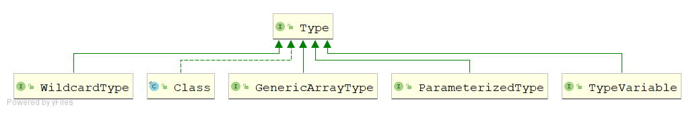
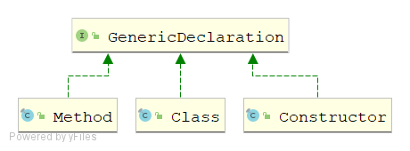
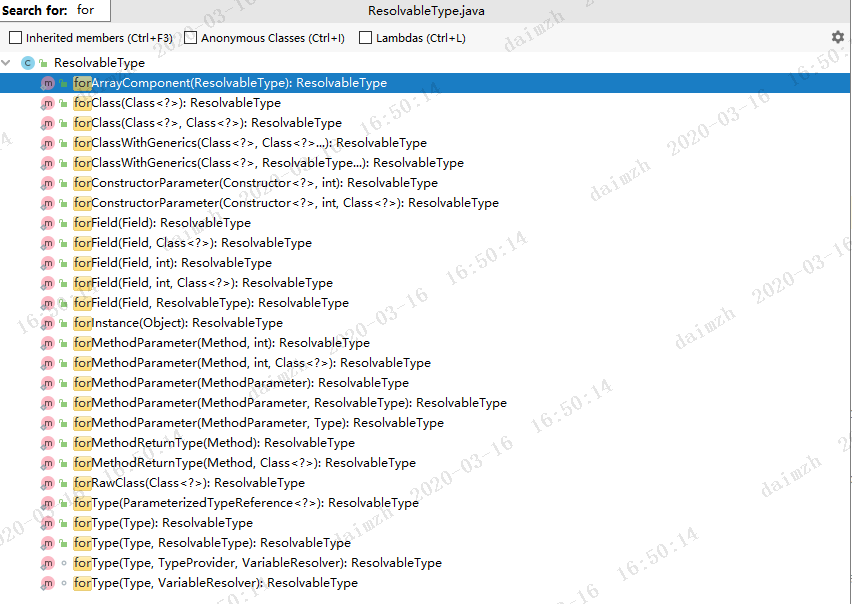
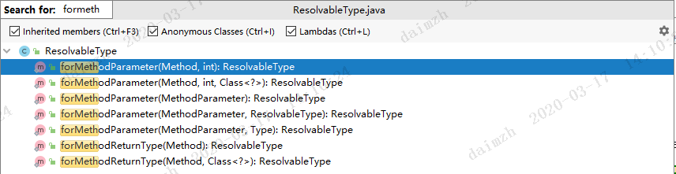

你真的了解泛型吗？从java的Type到Spring的ResolvableType

>关于泛型的基本知识在本文中不会过多提及，本文主要解决的是如何处理泛型，以及java中Type接口下对泛型的一套处理机制，进而分析Spring中的ResolvableType。

# Type

## 简介

Type是Java 编程语言中所有类型的公共高级接口（官方解释），也就是Java中所有类型的“爹”；其中，“所有类型”的描述尤为值得关注。它并不是我们平常工作中经常使用的 int、String、List、Map等数据类型，而是从Java语言角度来说，对基本类型、引用类型向上的抽象；

Type体系中类型的包括：原始类型(Class)、参数化类型(ParameterizedType)、数组类型(GenericArrayType)、类型变量(TypeVariable)、基本类型(Class);

原始类型，不仅仅包含我们平常所指的类，还包括枚举、数组、注解等；

参数化类型，就是我们平常所用到的泛型List<String>、Map<String,Integer>这种；

数组类型，并不是我们工作中所使用的数组String[] 、byte[]，而是带有泛型的数组，即T[] ；

基本类型，也就是我们所说的java的基本类型，即int,float,double等

**Type体系的出现主要是为了解决泛型的一系列问题。**

## 接口定义

```java
public interface Type {
   // 返回这个类型的名称
    default String getTypeName() {
        return toString();
    }
}
```

可以看到`Type`接口内只定义了一个方法，这个方法会返回该类型的名称

## UML类图



在上面的图中对于Class我相信大家都已经很了解了。我们主要对其余四个子接口进行测试分析

#### ParameterizedType

##### 简介

参数化类型，也就是我们所说的泛型。像List<String>就是一个参数化类型，但是List并不是，因为没有使用泛型。

##### 接口定义

```java
public interface ParameterizedType extends Type {
	// 对于一个参数化类型而言，必定是带有泛型的，所有这里是为了获取到其中的泛型的具体类型，也就是<>中的内容
    // 返回一个数组是因为，有时候会定义多个泛型，比如Map<String,String>
    Type[] getActualTypeArguments();

	// 获取原始类型，这里不带泛型，就是class
    Type getRawType();

	// 获取这个类所在类的类型，这里可能比较拗口，举个例子，假如当前这个ParameterizedType的类型为
    // O<T>.I<U>，那么调用这个方法所返回的就是一个O<T>类型
    Type getOwnerType();
}
```

##### 使用示例

```java
public class Main extends OwnerTypeDemo<String> {

    private List<String> stringList;

    private Map<String, String> stringStringMap;

    private Map.Entry<String, ?> entry;

    private OwnerTypeDemo<String>.Test<String> testOwnerType;

    private List list;

    private Map map;

    public void test(List<String> stringList, List list) {

    }

    public static void main(String[] args) {
        Class<Main> mainClass = Main.class;
        Field[] fields = mainClass.getDeclaredFields();
        for (Field field : fields) {
            Type genericType = field.getGenericType();
            String typeName = genericType.getTypeName();
            String name = field.getName();
            if (genericType instanceof ParameterizedType) {
                System.out.println(name + "是一个参数化类型,类型名称为：" + typeName);
                ParameterizedType parameterizedType = (ParameterizedType) genericType;
                Type[] actualTypeArguments = parameterizedType.getActualTypeArguments();
                System.out.println(name + "的actualTypeArguments：" + Arrays.toString(actualTypeArguments));
                Type ownerType = parameterizedType.getOwnerType();
                System.out.println(name + "的ownerType：" + ownerType);
                Type rawType = parameterizedType.getRawType();
                System.out.println(name + "的rawType：" + rawType);
            } else {
                System.out.println(name + "不是一个参数化类型,类型名称为：" + typeName);
            }
        }
        System.out.println("===================开始测试方法中的参数=========================");
        Method[] declaredMethods = mainClass.getDeclaredMethods();
        for (Method declaredMethod : declaredMethods) {
            String methodName = declaredMethod.getName();
            Type[] genericParameterTypes = declaredMethod.getGenericParameterTypes();
            for (int i = 0; i < genericParameterTypes.length; i++) {
                Type parameterType = genericParameterTypes[i];
                String typeName = parameterType.getTypeName();
                System.out.println("打印" + methodName + "方法的参数，" + "第" + (i + 1) + "个参数为：" + parameterType);
                if (parameterType instanceof ParameterizedType) {
                    System.out.println("第" + (i + 1) + "个参数是一个参数化类型, 类型名称为 ： " + typeName);
                } else {
                    System.out.println("第" + (i + 1) + "个参数不是一个参数化类型, 类型名称为 ： " + typeName);
                }
            }
        }
        System.out.println("===================开始测试父类中的泛型=========================");
        // 获取带有泛型的父类
        Type genericSuperclass = mainClass.getGenericSuperclass();
        if (genericSuperclass instanceof ParameterizedType) {
            System.out.println("父类是一个参数化类型，类型名称为：" + genericSuperclass.getTypeName());
        }

    }
}

class OwnerTypeDemo<T> {
    class Test<T> {

    }
}

```

程序会做如下输出：

```java
stringList是一个参数化类型,类型名称为：java.util.List<java.lang.String>
stringList的actualTypeArguments：[class java.lang.String]
stringList的ownerType：null
stringList的rawType：interface java.util.List
stringStringMap是一个参数化类型,类型名称为：java.util.Map<java.lang.String, java.lang.String>
stringStringMap的actualTypeArguments：[class java.lang.String, class java.lang.String]
stringStringMap的ownerType：null
stringStringMap的rawType：interface java.util.Map
entry是一个参数化类型,类型名称为：java.util.Map$Entry<java.lang.String, ?>
entry的actualTypeArguments：[class java.lang.String, ?]
entry的ownerType：interface java.util.Map
entry的rawType：interface java.util.Map$Entry
testOwnerType是一个参数化类型,类型名称为：main.java.OwnerTypeDemo<java.lang.String>$Test<java.lang.String>
testOwnerType的actualTypeArguments：[class java.lang.String]
testOwnerType的ownerType：main.java.OwnerTypeDemo<java.lang.String>
testOwnerType的rawType：class main.java.OwnerTypeDemo$Test
list不是一个参数化类型,类型名称为：java.util.List
map不是一个参数化类型,类型名称为：java.util.Map
===================开始测试方法中的参数=========================
打印main方法的参数，第1个参数为：class [Ljava.lang.String;
第1个参数不是一个参数化类型, 类型名称为 ： java.lang.String[]
打印test方法的参数，第1个参数为：java.util.List<java.lang.String>
第1个参数是一个参数化类型, 类型名称为 ： java.util.List<java.lang.String>
打印test方法的参数，第2个参数为：interface java.util.List
第2个参数不是一个参数化类型, 类型名称为 ： java.util.List
===================开始测试父类中的泛型=========================
父类是一个参数化类型，类型名称为：main.java.OwnerTypeDemo<java.lang.String>
```

------

通过上面的例子可以看出，`ParameterizedType`可以让我们明确字段或者方法参数上是否使用了泛型，并获取到泛型的具体类型。那是不是依赖`ParameterizedType`就能解决所有的泛型问题了呢？答案显然是不是的，我们看一个特殊的例子：

```java
public class SpecialDemo<T extends Type> {

    T t;

    public static void main(String[] args) {
        Class<SpecialDemo> specialDemoClass = SpecialDemo.class;
        Field[] declaredFields = specialDemoClass.getDeclaredFields();
        for (Field declaredField : declaredFields) {
            Type genericType = declaredField.getGenericType();
            if (genericType instanceof ParameterizedType) {
                System.out.println("t是一个参数化类型");
            } else {
                System.out.println("t不是一个参数化类型");
            }
        }
    }
    // 程序输出：t不是一个参数化类型
}
```

运行上面的程序，会发现字段t不是一个参数化类型，这就意味着没办法通过`ParameterizedType`来解决这一类泛型问题。我们分析`<T extends Type>`，会发现其实T类似于一个变量，我们可以在使用时可以传入具体的类，比如我们可以这样：

```java
SpecialDemo<ParameterizedType> specialDemo = new SpecialDemo<>();
```

同时这个基于这个`<T extends Type>`表达式，我们知道这个变量是具有属性的，最直观的就是T是有上界的，所有的T都继承了`Type`。基于这种情况，Java对其进行了抽象，得到了一个新的类型`TypeVariable`。

#### TypeVariable

##### 简介

类型变量，或者也可以叫泛型变量。具体就是指我们在申明泛型时定义的`T,K,U`这种变量。在之前的例子中，`SpecialDemo<T extends Type>`，T就是一个类型变量。

##### 接口定义

```java
public interface TypeVariable<D extends GenericDeclaration> extends Type, AnnotatedElement {
    // 获取泛型的边界
    Type[] getBounds();
	// 获取申明所在的具体对象
    D getGenericDeclaration();
	// 获取具体类型变量的名称
    String getName();
	// 获取类型变量边界上添加的注解
    AnnotatedType[] getAnnotatedBounds();
}
```

可以看到，`TypeVariable`本身也使用了泛型，并且泛型的上界为`GenericDeclaration`。在了解`TypeVariable`之前，有必要先对`GenericDeclaration`做一个简单的说明。`GenericDeclaration`这个接口主要限定了哪些地方可以定义`TypeVariable`，换言之，也就是定义了哪些地方可以申明泛型。这个接口只有3个实现类（忽略`Executable`抽象类）。如下：



从这里我们也能看到，我们只能在方法（包括普通方法跟构造方法）以及类上申明泛型。

这里需要对接口定义的方法做进一步的说明：

1. getBounds()会返回泛型的边界，但是这里的边界跟我们在参数化类型中定义的边界不同，这里的边界只有上界。即我们不通通过super关键字来申明一个泛型，例如下面这种：

```java
class A<T super classA>{}
```

在申明泛型时，我们要明确一点，***申明是为了使用***，而在上面的例子中，我们不能使用T来干任何事情，因为我们不能确定T中的任何方法（只能确定它是一个Object，但是这没有任何意义）。所以对于泛型变量来说，只存在上界，也就是只能使用extends关键字进行申明

2. getGenericDeclaration()，返回泛型申明时所在的类或者方法
3. 返回泛型变量的名称，也就是我们定义泛型时采用的T,K,U这一类的名称
4. getAnnotatedBounds()，此方法返回一个`AnnotatedType`类型的数组，获取的是我们在类型变量的上界。不同于getBounds()方法的是，这个方法可以获取到边界上添加的注解

##### 使用示例

```java
public class TypeVariableMain<T, K extends @TypeAnnotation Integer & Type> {

    public <U extends Long, V> void testTypeVariable(Map<U, V> map) {

    }

    public static void main(String[] args) {
        Class<TypeVariableMain> typeVariableMainClass = TypeVariableMain.class;
        TypeVariable<Class<TypeVariableMain>>[] typeParameters = typeVariableMainClass.getTypeParameters();
        for (int i = 0; i < typeParameters.length; i++) {
            TypeVariable<Class<TypeVariableMain>> typeParameter = typeParameters[i];
            Type[] bounds = typeParameter.getBounds();
            String name = typeParameter.getName();
            AnnotatedType[] annotatedBounds = typeParameter.getAnnotatedBounds();
            Class<TypeVariableMain> genericDeclaration = typeParameter.getGenericDeclaration();
            System.out.println("第" + (i + 1) + "个类型变量的名称为：" + name);
            System.out.println("通过getBounds方法获取到，第" + (i + 1) + "个类型变量的边界为：" + Arrays.toString(bounds));
            System.out.println("第" + (i + 1) + "个类型变量的申明的位置为：" + genericDeclaration);
            System.out.println("通过getAnnotatedBounds方法获取到，第" + (i + 1) + "个类型变量的边界为："
                    + Arrays.stream(annotatedBounds).map(AnnotatedType::getType).collect(Collectors.toList()));
            for (AnnotatedType annotatedType : annotatedBounds) {
                Annotation[] annotations = annotatedType.getAnnotations();
                if (annotations.length > 0) {
                    System.out.println("第" + (i + 1) + "个类型变量的上界上添加了注解，注解为" + annotations[0]);
                }
            }
        }
        System.out.println("===================基于方法获取类型变量====================");
        Method[] declaredMethods = typeVariableMainClass.getDeclaredMethods();
        for (Method declaredMethod : declaredMethods) {
            String methodName = declaredMethod.getName();
            if (methodName.equals("main")) {
                // 为了方便，直接排除main函数了
                continue;
            }
            TypeVariable<Method>[] typeVariables = declaredMethod.getTypeParameters();
            int i = 1;
            for (TypeVariable<Method> typeVariable : typeVariables) {
                System.out.println("方法：\"" + methodName + "\"的第" + (i++) + "个类型变量为" + typeVariable.getName());
            }
        }
    }
}
```

程序打印如下：

```java
第1个类型变量的名称为：T
通过getBounds方法获取到，第1个类型变量的边界为：[class java.lang.Object]
第1个类型变量的申明的位置为：class main.java.TypeVariableMain
通过getAnnotatedBounds方法获取到，第1个类型变量的边界为：[class java.lang.Object]
第2个类型变量的名称为：K
通过getBounds方法获取到，第2个类型变量的边界为：[class java.lang.Integer, interface java.lang.reflect.Type]
第2个类型变量的申明的位置为：class main.java.TypeVariableMain
通过getAnnotatedBounds方法获取到，第2个类型变量的边界为：[class java.lang.Integer, interface java.lang.reflect.Type]
第2个类型变量的上界上添加了注解，注解为@main.java.TypeAnnotation()
===================基于方法获取类型变量====================
方法："testTypeVariable"的第1个类型变量为U
方法："testTypeVariable"的第2个类型变量为V
```

-------

为了让大家加深对`ParameterizedType`以及`TypeVariable`理解，这里我额外添加一个Demo

```java
public class TypeVariableMain02<T, K extends @TypeAnnotation Integer & Type> {

    private K k;

    private List<T> list;

    public static void main(String[] args) {
        Class<TypeVariableMain02> typeVariableMain02Class = TypeVariableMain02.class;

        Field[] declaredFields = typeVariableMain02Class.getDeclaredFields();
        for (Field field : declaredFields) {
            Type genericType = field.getGenericType();
            String typeName = genericType.getTypeName();
            String name = field.getName();
            if (genericType instanceof ParameterizedType) {
                System.out.println(name + "是一个参数化类型,类型名称为：" + typeName);
                ParameterizedType parameterizedType = (ParameterizedType) genericType;
                Type[] actualTypeArguments = parameterizedType.getActualTypeArguments();
                System.out.println(name + "的actualTypeArguments：" + Arrays.toString(actualTypeArguments));
                Type ownerType = parameterizedType.getOwnerType();
                System.out.println(name + "的ownerType：" + ownerType);
                Type rawType = parameterizedType.getRawType();
                System.out.println(name + "的rawType：" + rawType);
                for (Type actualTypeArgument : actualTypeArguments) {
                    if (actualTypeArgument instanceof TypeVariable) {
                        System.out.println("字段：" + name + "中包含一个类型变量");
                        String name1 = ((TypeVariable) actualTypeArgument).getName();
                        AnnotatedType[] annotatedBounds = ((TypeVariable) actualTypeArgument).getAnnotatedBounds();
                        Type[] bounds = ((TypeVariable) actualTypeArgument).getBounds();
                        GenericDeclaration genericDeclaration = ((TypeVariable) actualTypeArgument).getGenericDeclaration();
                        System.out.println("类型变量的名称为：" + name1);
                        System.out.println("个类型变量的边界为：" + Arrays.toString(bounds));
                        System.out.println("类型变量的申明的位置为：" + genericDeclaration);
                        System.out.println("通过getAnnotatedBounds方法获取到，类型变量的边界为：" + annotatedBounds[0].getType());
                    }
                }
            } else if (genericType instanceof TypeVariable) {
                System.out.println(name + "是一个类型变量,类型名称为：" + typeName);
                TypeVariable typeVariable = (TypeVariable) genericType;
                Type[] bounds = typeVariable.getBounds();
                String name1 = typeVariable.getName();
                AnnotatedType[] annotatedBounds = typeVariable.getAnnotatedBounds();
                GenericDeclaration genericDeclaration = typeVariable.getGenericDeclaration();
                System.out.println("类型变量的名称为：" + name1);
                System.out.println("个类型变量的边界为：" + Arrays.toString(bounds));
                System.out.println("类型变量的申明的位置为：" + genericDeclaration);
                System.out.println("通过getAnnotatedBounds方法获取到，类型变量的边界为：" + annotatedBounds[0].getType() + "  " + annotatedBounds[1].getType());
            }
        }
    }
}
```

程序输出：

```java
k是一个类型变量,类型名称为：K
类型变量的名称为：K
个类型变量的边界为：[class java.lang.Integer, interface java.lang.reflect.Type]
类型变量的申明的位置为：class main.java.TypeVariableMain02
通过getAnnotatedBounds方法获取到，类型变量的边界为：class java.lang.Integer  interface java.lang.reflect.Type
list是一个参数化类型,类型名称为：java.util.List<T>
list的actualTypeArguments：[T]
list的ownerType：null
list的rawType：interface java.util.List
字段：list 中包含一个类型变量
类型变量的名称为：T
个类型变量的边界为：[class java.lang.Object]
类型变量的申明的位置为：class main.java.TypeVariableMain02
通过getAnnotatedBounds方法获取到，类型变量的边界为：class java.lang.Object
```

#### GenericArrayType

##### 简介

GenericArrayType是Type的子接口，用于表示“泛型数组”，描述的是形如：A<T>[]或T[]的类型。其实也就是描述ParameterizedType类型以及TypeVariable类型的数组，即形如：classA<T>[][]、T[]等

##### 接口定义

```java
public interface GenericArrayType extends Type {
    // 返回数组中元素的类型，TypeVariable或者ParameterizedType
    Type getGenericComponentType();
}
```

##### 使用示例

```java
public class GenericArrayTypeMain<T> {
    T[] t1;

    T[][] t2;

    List<T> list;

    List<String>[] stringListArray;

    String[][] stringArray;

    public static void main(String[] args) {
        Class<GenericArrayTypeMain> genericArrayTypeMainClass = GenericArrayTypeMain.class;
        Field[] declaredFields = genericArrayTypeMainClass.getDeclaredFields();
        for (Field declaredField : declaredFields) {
            String name = declaredField.getName();
            Type genericType = declaredField.getGenericType();
            if (genericType instanceof GenericArrayType) {
                System.out.println(name + "是一个泛型数组");
                Type genericComponentType = ((GenericArrayType) genericType).getGenericComponentType();
                System.out.println("数组的元素类型为：" + genericComponentType);
            } else {
                System.out.println(name + "不是一个泛型数组");
            }
        }
    }
}
```

程序输出：

```java
t1是一个泛型数组
数组的元素类型为：T
t2是一个泛型数组
数组的元素类型为：T[]
list不是一个泛型数组
stringListArray是一个泛型数组
数组的元素类型为：java.util.List<java.lang.String>
stringArray不是一个泛型数组
```

通过上面的Demo我们会发现，无论从左向右有几个[]并列，这个方法仅仅脱去最右边的[]之后剩下的内容就作为这个方法的返回值。

另外，在上面的例子中，大家可以思考以下几个问题：

1. t1是一个泛型数组，数组的元素类型为：T，那么T是一个什么类型呢？
2. t2是一个泛型数组，数组的元素类型为：T[]，那么T[]又是什么类型？

上述问题留给大家自行思考

------

了解了ParameterizedType跟TypeVariable以及这两种类型的数组类型GenericArrayType之后，接着我们思考一个问题，我们在定义泛型时，经常会使用来通配符，形如下面这种形式`{? extends Number}`，这个时候即使我们获取到`? extends Number`也没有办法做进一步的处理。这个时候就要用到我们接下来要介绍的这个接口了，请往下看

#### WildcardType

##### 简介

专门用来处理泛型中的通配符，需要注意的是，`WildcardType`并不是JAVA所有类型中的一种，表示的仅仅是类似 `{? extends T}`、`{? super K}`这样的通配符表达式。

##### 接口定义

```java
public interface WildcardType extends Type {
	
    // 获取通配符表达式的上界
    Type[] getUpperBounds();
	
    // 获取通配符表达式的下界
    Type[] getLowerBounds();

}
```

上面这两个方法之所以会返回数组是为了保持扩展性，实际上现在返回的数组的大小就是1，JDK8中至少是这样的吗，更高版本的没有去尝试。

##### 使用示例

```java
public class WildcardTypeDemo<T> {

    Map<? super String, ? extends List<T>> map;

    public static void main(String[] args) {
        Class<WildcardTypeDemo> wildcardTypeDemoClass = WildcardTypeDemo.class;
        Field[] declaredFields = wildcardTypeDemoClass.getDeclaredFields();
        for (Field field : declaredFields) {
            Type genericType = field.getGenericType();
            if (genericType instanceof ParameterizedType) {
                // 使用了通配符表达泛型的，必定是一个参数化类型
                // 获取泛型的实际类型，就是获取<>中的内容,这里获取到的是<? super String, ? extends List<T>>
                Type[] actualTypeArguments = ((ParameterizedType) genericType).getActualTypeArguments();
                for (Type actualTypeArgument : actualTypeArguments) {
                    // 两个泛型都使用了通配符，都会进入这个判断
                    if (actualTypeArgument instanceof WildcardType) {
                        // 分別获取上界跟下界
                        // ? super String，这个表达式的下界为String,上界为Object
                        // ? extends List<T>，这个表达式的下界为Object,上界为List<T>，
                        // 同时List<T>又是一个参数化类型，而T又是一个类型变量
                        Type[] lowerBounds = ((WildcardType) actualTypeArgument).getLowerBounds();
                        Type[] upperBounds = ((WildcardType) actualTypeArgument).getUpperBounds();
                        // 这里我主要处理? extends List<T>
                        for (Type upperBound : upperBounds) {
                            if (upperBound instanceof ParameterizedType) {
                                System.out.println("参数化类型的名称为：" + upperBound.getTypeName());
                                Type[] actualTypeArguments1 = ((ParameterizedType) upperBound).getActualTypeArguments();
                                for (Type type : actualTypeArguments1) {
                                    if (type instanceof TypeVariable) {
                                        String name = ((TypeVariable) type).getName();
                                        System.out.println("类型变量名称为：" + name);
                                    }
                                }
                            }
                        }
                    }
                }
            }
        }
    }
    
    // 程序输出：
    // 参数化类型的名称为：java.util.List<T>
	// 类型变量名称为：T
```

我相信如果你对Java中的类型已经完全理解了，上面的代码配合注释应该不难看懂

# ResolvableType

在学习了Java的Type体系后，我们会发现，依赖于整个Type体系去处理泛型代码非常的繁琐，并且不易于理解。基于这种情况，Spring开发了一个`ResolvableType`类，这个类对整个Type体系做了系统的封装。

>  实际上关于`ResolvableType`的学习大家可以参数Spring中的`org.springframework.core.ResolvableTypeTests`类,这是作者写好的单元测试类，覆盖了`ResolvableType`的所有方法。

这个类的代码量很大，不过我们也没有必要去详细地看每一行代码，粗略阅读源码后会发现这个类有以下几个特点

## 概览

1. 所有的构造函数都是私有的


在上图中那把小锁代表权限为private，就是私有的意思

2. 构造函数都是在为相同的成员变量赋值，这里我随便放一个构造函数如下

```java
private ResolvableType(Type type, @Nullable TypeProvider typeProvider,
                       @Nullable VariableResolver variableResolver, @Nullable ResolvableType componentType) {

    this.type = type;
    this.typeProvider = typeProvider;
    this.variableResolver = variableResolver;
    this.componentType = componentType;
    this.hash = null;
    this.resolved = resolveClass();
}
```

3. 因为构造函数是私有的，所有它提供了一系列的方法来创建一个ResolvableType，如下：



所有for开头的方法都是静态方法，同时都能获取一个ResolvableType，现在对常见的几个方法进行分析：

## 方法分析

### forClass系列方法

Spring中经常会用到一个方法，`ResolvableType.forRawClass(type)`，我们就先看下这一系列的三个方法

1. ResolvableType.forRawClass(type)
2. ResolvableType forClass(@Nullable Class<?> clazz)
3. ResolvableType forClass(Class<?> baseType, Class<?> implementationClass)
4. ResolvableType forClassWithGenerics(Class<?> clazz, Class<?>... generics)
5. ResolvableType forClassWithGenerics(Class<?> clazz, ResolvableType... generics) 

#### forRawClass(Class<?> clazz) 

```java
public static ResolvableType forRawClass(@Nullable Class<?> clazz) {
    return new ResolvableType(clazz) {
        @Override
        public ResolvableType[] getGenerics() {
            return EMPTY_TYPES_ARRAY;
        }
        @Override
        public boolean isAssignableFrom(Class<?> other) {
            return (clazz == null || ClassUtils.isAssignable(clazz, other));
        }
        @Override
        public boolean isAssignableFrom(ResolvableType other) {
            Class<?> otherClass = other.getRawClass();
            return (otherClass != null && (clazz == null || ClassUtils.isAssignable(clazz, otherClass)));
        }
    };
}
```

这个方法实际上做了两件事

1. 调用了构造函数，`private ResolvableType(@Nullable Class<?> clazz)`
2. 复写了三个方法

对比另外一个方法

#### forClass(Class<?> clazz)

```java
public static ResolvableType forClass(@Nullable Class<?> clazz) {
    return new ResolvableType(clazz);
}
```

对比后可以发现，这两个方法唯一的区别就是没有复写其中的三个方法。大家可以思考下，这是为什么呢？

>  其实区别在于，对于第一个`forRawClass`方法，入参传入的一定是一个原始数据类型，也就是一个不带泛型的类的Class对象，比如传入的可能是一个Person.class，Dog.class。对于这种原始数据类型，其`getGenerics`，`isAssignableFrom`方法的实现逻辑是固定的，所以`forRawClass`方法直接对这三个方法进行了复写。

####  forClass(Class<?> baseType, Class<?> implementationClass)

```java
public static ResolvableType forClass(Class<?> baseType, Class<?> implementationClass) {
    Assert.notNull(baseType, "Base type must not be null");
    // as方法在之后分析，就是根据继承链找打对应的父类
    ResolvableType asType = forType(implementationClass).as(baseType);
    return (asType == NONE ? forType(baseType) : asType);
}
```

implementationClass是baseType的子类，这个方法主要获取baseType上定义的泛型，例如：

```java
public class ResolvableTypeDemo {
    public static void main(String[] args) {
  		// 获取到C继承的HashMap所构建的一个ResolvableType，会带用泛型<String, Integer>
        ResolvableType resolvableType = ResolvableType.forClass(HashMap.class, C.class);
        ResolvableType[] generics = resolvableType.getGenerics();
        for (ResolvableType generic : generics) {
            // 程序打印：
            // class java.lang.String
            // class java.lang.Integer
            System.out.println(generic.getType());
        }
    }
}

class C extends HashMap<String, Integer> {

}
```

### forConstructor系列方法

```java
public static ResolvableType forConstructorParameter(Constructor<?> constructor, int parameterIndex,
                                                     Class<?> implementationClass) {

    Assert.notNull(constructor, "Constructor must not be null");
    MethodParameter methodParameter = new MethodParameter(constructor, parameterIndex);
    methodParameter.setContainingClass(implementationClass);
    return forMethodParameter(methodParameter);
}

public static ResolvableType forConstructorParameter(Constructor<?> constructor, int parameterIndex) {
    Assert.notNull(constructor, "Constructor must not be null");
    return forMethodParameter(new MethodParameter(constructor, parameterIndex));
}
```

可以看到，forConstructor系列方法最后都调用了forMethod系列方法，我们直接分析forMethod系列的方法

### forMethod系列方法



主要分为两类方法

1. forMethodParameter，解决方法参数上的类型问题
2. forMethodReturnType，解决方法返回值的类型问题

#### forMethodParameter

```java
public class ResolvableTypeDemo {

    public void test(List<String> list, Map<String, List<Integer>> map) {

    }

    public static void main(String[] args) throws Exception {
        Class<ResolvableTypeDemo> resolvableTypeDemoClass = ResolvableTypeDemo.class;
        Method[] declaredMethods = resolvableTypeDemoClass.getDeclaredMethods();
        Method test = declaredMethods[1];
        // 获取方法的第一个参数对应的ResolvableType，参数为-1代表返回值，0为第一个，1为第二个，一次增加
        ResolvableType resolvableType0 = ResolvableType.forMethodParameter(test, 0);
        System.out.println(resolvableType0.resolve());
        System.out.println(resolvableType0.getType());
         // 获取方法的第二个参数对应的ResolvableType
        ResolvableType resolvableType1 = ResolvableType.forMethodParameter(test, 1);
        System.out.println(resolvableType1.resolve());
        System.out.println(resolvableType1.getType());
    }
}
```

#### forMethodReturnType

```java
public static ResolvableType forMethodReturnType(Method method) {
    Assert.notNull(method, "Method must not be null");
    return forMethodParameter(new MethodParameter(method, -1));
}
```

调用逻辑很简单，调用forMethodParameter，并将方法的参数索引替换为-1，代表返回值

### forConstructor系列方法

构造函数就是一个特殊的方法，所以都是直接调用的forMethod系列方法，这里就不多介绍了

### forField系列方法

专门用于处理字段的类型，如下：


测试方法Demo

```java
public class ResolvableTypeDemo {

    List<String> stringList;

    List<List<String>> lists;

    public static void main(String[] args) throws Exception {
        Class<ResolvableTypeDemo> resolvableTypeDemoClass = ResolvableTypeDemo.class;
        Field[] declaredFields = resolvableTypeDemoClass.getDeclaredFields();
        for (Field declaredField : declaredFields) {
            System.out.println("=======字段名称"+declaredField.getName()+"=========");
            System.out.println("nestingLevel为1");
            ResolvableType resolvableType1 = ResolvableType.forField(declaredField,1);
            System.out.println(resolvableType1.getType());
            System.out.println(resolvableType1.resolve());
            System.out.println("nestingLevel为2");
            ResolvableType resolvableType2 = ResolvableType.forField(declaredField,2);
            System.out.println(resolvableType2.getType());
            System.out.println(resolvableType2.resolve());
            System.out.println("nestingLevel为3");
            ResolvableType resolvableType3 = ResolvableType.forField(declaredField,3);
            System.out.println(resolvableType3.getType());
            System.out.println(resolvableType3.resolve());
        }
    }
}
```

程序打印：

```java
=======字段名称stringList=========
nestingLevel为1
java.util.List<java.lang.String>
interface java.util.List
nestingLevel为2
class java.lang.String
class java.lang.String
nestingLevel为3
org.springframework.core.ResolvableType$EmptyType@723279cf
null
=======字段名称lists=========
nestingLevel为1
java.util.List<java.util.List<java.lang.String>>
interface java.util.List
nestingLevel为2
java.util.List<java.lang.String>
interface java.util.List
nestingLevel为3
class java.lang.String
class java.lang.String
```

在上面的所有方法，最后都会调用一个forType方法，所以我们着重也就分析这个系列的方法

### forType系列（源码分析）


最终都会调用到这个方法中，源码如下：

```java
static ResolvableType forType(
    @Nullable Type type, @Nullable TypeProvider typeProvider, @Nullable VariableResolver variableResolver) {
	
    // 这里可以看出，即使我们提供了一个typeProvider，也不会直接调用它的getType返回，而是会进行一层包装，这个是为什么呢？我们稍后分析
    if (type == null && typeProvider != null) {
        type = SerializableTypeWrapper.forTypeProvider(typeProvider);
    }
    
    if (type == null) {
        // 自身定义的一个常量，ResolvableType NONE = new ResolvableType(EmptyType.INSTANCE, null, null, 0);
        return NONE;
    }

	// 如果是原始的数据类型（一个简单的Class引用），那么直接封装后返回，这里不做缓存，因为没有上面昂贵的开销
    if (type instanceof Class) {
        return new ResolvableType(type, typeProvider, variableResolver, (ResolvableType) null);
    }

	// 省略缓存相关的代码。。。
    return resultType;
}
```

上面这段代码比较核心的就是`SerializableTypeWrapper.forTypeProvider(typeProvider)`，我之前也提到了一个问题，为什么要多包装一层呢？这么做的目的主要就是为了得到一个可以进行序列化的Type。

它的核心代码如下：

```java
static Type forTypeProvider(TypeProvider provider) {
    // 直接从provider获取到具体的类型
    Type providedType = provider.getType();
    if (providedType == null || providedType instanceof Serializable) {
        // 如果本身可以序列化的直接返回，例如Java.lang.Class。
        // 如果不能进行序列化，多进行一层包装
        return providedType;
    }
    // 不用管这段代码，我们开发过程中必定不成立
    if (GraalDetector.inImageCode() || !Serializable.class.isAssignableFrom(Class.class)) {
        return providedType;
    }

    // 从缓存中获取
    Type cached = cache.get(providedType);
    if (cached != null) {
        return cached;
    }
    // 遍历支持的集合，就是GenericArrayType.class, ParameterizedType.class, TypeVariable.class, WildcardType.class，处理这个四种类型
    for (Class<?> type : SUPPORTED_SERIALIZABLE_TYPES) {
        if (type.isInstance(providedType)) {
            ClassLoader classLoader = provider.getClass().getClassLoader();
            // 创建的代理类实现的接口，type就不用说了代理类跟目标类必须是同一个类型
            // SerializableTypeProxy：标记接口，标志是一个代理类
            // Serializable：代表可以被序列化
            Class<?>[] interfaces = new Class<?>[] {type, SerializableTypeProxy.class, Serializable.class};
            // 核心代码：TypeProxyInvocationHandler是什么？
            InvocationHandler handler = new TypeProxyInvocationHandler(provider);
            // 依赖于先前的InvocationHandler，以当前的type为目标对象创建了一个代理对象
            // 
            cached = (Type) Proxy.newProxyInstance(classLoader, interfaces, handler);
            cache.put(providedType, cached);
            return cached;
        }
    }
    throw new IllegalArgumentException("Unsupported Type class: " + providedType.getClass().getName());
}
```

解析来我们分下下`TypeProxyInvocationHandler`这个类

```java
private static class TypeProxyInvocationHandler implements InvocationHandler, Serializable {

    private final TypeProvider provider;

    public TypeProxyInvocationHandler(TypeProvider provider) {
        this.provider = provider;
    }

    @Override
    @Nullable
    public Object invoke(Object proxy, Method method, @Nullable Object[] args) throws Throwable {
        // 复写目标类的equals方法
        if (method.getName().equals("equals") && args != null) {
            Object other = args[0];
            // Unwrap proxies for speed
            if (other instanceof Type) {
                other = unwrap((Type) other);
            }
            return ObjectUtils.nullSafeEquals(this.provider.getType(), other);
        }
        // 复写目标类的hashCode方法
        else if (method.getName().equals("hashCode")) {
            return ObjectUtils.nullSafeHashCode(this.provider.getType());
        }
        
         // 复写目标类的getTypeProvider方法
        else if (method.getName().equals("getTypeProvider")) {
            return this.provider;
        }
		
        // 之所以不直接返回method.invoke(this.provider.getType(), args);也是为了缓存
        // 空参的时候才能缓存，带参数的话不能缓存，因为每次调用传入的参数可能不一样
        if (Type.class == method.getReturnType() && args == null) {
            return forTypeProvider(new MethodInvokeTypeProvider(this.provider, method, -1));
        }
        else if (Type[].class == method.getReturnType() && args == null) {
            Type[] result = new Type[((Type[]) method.invoke(this.provider.getType())).length];
            for (int i = 0; i < result.length; i++) {
                result[i] = forTypeProvider(new MethodInvokeTypeProvider(this.provider, method, i));
            }
            return result;
        }

        try {
            return method.invoke(this.provider.getType(), args);
        }
        catch (InvocationTargetException ex) {
            throw ex.getTargetException();
        }
    }
}
```

------

# 总结

在这篇文章中我们主要学习了java的Type机制，如下：


Type主要是用来处理泛型的，但是通过Java原始的这一套，处理起来及其的繁琐，所以Spring自行封装了一个ResolvableType，我们在处理类，方法，构造函数，字段时，只需要调用对应的方法就能返回一个对应的ResolvableType，一个ResolvableType就封装了对应的这个对象的原始类型，泛型等等，封装了Java中的所有类型。从这里也能看出Spring的牛逼之处，处理提供了IOC,AOP这两个强大的功能，还封装了一系列的简单易用的工具类。